# Design Document

Authors: Alberto Cipollina, Florin Gheorghiu, Simone de Stefano

Date: 30/04/2021

Version: 1

# Contents

- [High level design](#package-diagram)
- [Low level design](#class-diagram)
- [Verification traceability matrix](#verification-traceability-matrix)
- [Verification sequence diagrams](#verification-sequence-diagrams)

# Instructions

The design must satisfy the Official Requirements document, notably functional and non functional requirements.

# High level design

It will be used MCV Pattern, 3 tier architecture.
It will be used hibernate for persistence.

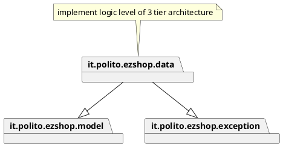

# Low level design

Facade Pattern.
Singleton for each \*Manager class.

```plantuml
@startuml
left to right direction
package it.polito.ezshop.data {

class EzShop {
+createUser()
+deleteUser()
+getAllUsers()
+getUser()
+updateUserRights()
+login()
+logout()
+createProductType()
+updateProduct()
+deleteProductType()
+getAllProductTypes()
+getProductTypeByBarCode()
+getProductTypesByDescription()
+updateQuantity()
+updatePosition()
+issueReorder()
+payOrderFor()
+payOrder()
+recordOrderArrival()
+getAllOrders()
+getAllOrders()
+defineCustomer()
+modifyCustomer()
+deleteCustomer()
+getCustomer()
+getAllCustomers()
+createCard()
+attachCardToCustomer()
+modifyPointsOnCard()
+startSaleTransaction()
+addProductToSale()
+deleteProductFromSale()
+applyDiscountRateToProduct()
+applyDiscountRateToSale()
+computePointsForSale()
+closeSaleTransaction()
+deleteSaleTicket()
+getSaleTicket()
+getTicketByNumber()
+startReturnTransaction()
+returnProduct()
+endReturnTransaction()
+receiveCashPayment()
+receiveCreditCardPayment()
+returnCashPayment()
+returnCreditCardPayment()
+recordBalanceUpdate()
+getCreditsAndDebits()
+computeBalance()
}

class AccountingManager {
+recordBalanceUpdate()
+getCreditsAndDebits()
+computeBalance()
}


class PaymentManager{
+receiveCashPayment()
+receiveCreditCardPayment()
+returnCashPayment()
+returnCreditCardPayment()
}


class SaleTransactionManager {
+startSaleTransaction()
+addProductToSale()
+deleteProductFromSale()
+applyDiscountRateToProduct()
+applyDiscountRateToSale()
+computePointsForSale()
+closeSaleTransaction()
+deleteSaleTicket()
+getSaleTicket()
+getTicketByNumber()
+startReturnTransaction()
+returnProduct()
+endReturnTransaction()
}

class CustomerManager {
+defineCustomer()
+modifyCustomer()
+deleteCustomer()
+getCustomer()
+getAllCustomers()
+createCard()
+attachCardToCustomer()
+modifyPointsOnCard()
}

class InventoryManager{
+updateQuantity()
+updatePosition()
+issueReorder()
+payOrderFor()
+payOrder()
+recordOrderArrival()
+getAllOrders()
+getAllOrders()
}


class ProductTypeManager {
+createProductType()
+updateProduct()
+deleteProductType()
+getAllProductTypes()
+getProductTypeByBarCode()
+getProductTypesByDescription()
}

class AuthenticationManager{
User userLogged
+updateUserRights()
+login()
+logout()

}

class UserManager {
+createUser()
+deleteUser()
+getAllUsers()
+getUser()

}
note bottom of OperationType: this is the enum containing constants which\nrepresents actions can be performed by any user. Every Class\n manager has it's own OperationType in order to\n check if user who request to use some method\n can access them.
enum OperationType {

    CAN_MANAGE_USER
    CAN_MANAGE_CATALOGUE
    CAN_LIST_PRODUCTS
    CAN_MANAGE_INVENTORY
    CAN_MANAGE_CUSTOMER_AND_CARDS
    CAN_MANAGE_SALES
    CAN_MANAGE_PAYMENTS
    CAN_MANAGE_ACCOUNTING


}

EzShop -down- AuthenticationManager
EzShop -down- PaymentManager
EzShop -down-- SaleTransactionManager
EzShop -down-- AccountingManager
 EzShop --down- UserManager
 EzShop -down- InventoryManager
 EzShop -down- InventoryManager
 EzShop -down- CustomerManager
 EzShop -down- ProductTypeManager
}

package it.polito.ezshop.model {


class User {
firstname
lastname
email
password
id
Role
}

class Role {
id
name
boolean canManageUser
boolean canManageCatalogue
boolean canListProducts
boolean canManageInventory
boolean canManageCustomerAndCards
boolean canManageSales
boolean canManagePayments
boolean canManageAccounting
HashMap grantsMap : util structure for check grants of an user
}


class SaleTransaction {
id
date
time
cose
paymentType
totalDiscount
}

class ReturnTransaction{
date
SaleTransaction
returnId
quantityReturned
}

class ProductLine {

productTypeId
quantitySold
price
}


class Customer {
id
name
surname
email
phoneNumber
}

class Card{
id
points
}


class Order{
orderId
productTypeId
supplier
date
status
quantity
pricePerUnit
}


class ProductType{
productTypeId
barcode
sellPrice
quantity
discountRate
notes
}

ProductType "*" -up- InventoryManager
Order "*" -up- InventoryManager
ProductType "*" -up- ProductTypeManager
PaymentManager -down- "*" ReturnTransaction
AccountingManager -down- "*" SaleTransaction
AccountingManager -down- "*" ReturnTransaction
AccountingManager -down- "*" Order


AuthenticationManager -down- User
User -down- Role


UserManager -down- "*" User
Customer "*" -up-  CustomerManager

Card "*" -up- CustomerManager

Customer -right- "0..1" Card


ProductLine -right- "*" ReturnTransaction

SaleTransaction -- "1..*" ProductLine

SaleTransactionManager -- "*" SaleTransaction

SaleTransactionManager -- "*" ReturnTransaction

note  "all relationships must be explicit whithn each class: useing List,ArrayList ecc" as N1
}
@enduml
```

```plantuml
package it.polito.ezshop.exception {

class EzShopException{
+printMessage()
message
code
}

class InvalidUsernameException{
username
}

class InvalidRoleException {
role
username
}

class InvalidUserIdException{
userId
}

class InvalidProductDescriptionException {
productTypeId
description
}

class InvalidLocationException {
location
}

class InvalidQuantityException {
quantity
}

class InvalidCustomerCardException {
cardId
}
class InvalidTransactionIdException {
transactionId
}
class InvalidDiscountRateException {
discountRate
}
class InvalidTicketNumberException {
ticketNumber
}
class InvalidPaymentException {
amount
}
class InvalidCreditCardException {
cardNumber
}

InvalidRoleException --right-|> EzShopException
InvalidUserIdException --down-|> EzShopException
UnauthorizedException --left-|> EzShopException
InvalidUsernameException -down---|> EzShopException
InvalidProductDescriptionException -down---|> EzShopException
InvalidProductCodeException  -left----|> EzShopException
InvalidPricePerUnitException -left----|> EzShopException
InvalidProductIdException -down-|> EzShopException
InvalidLocationException -up-|> EzShopException
InvalidQuantityException -up-|> EzShopException
InvalidOrderIdException -up-|> EzShopException
InvalidCustomerNameException -up-|> EzShopException
InvalidCustomerCardException -right----|> EzShopException
InvalidTransactionIdException -right----|> EzShopException
InvalidDiscountRateException -down----|> EzShopException
InvalidTicketNumberException -down----|> EzShopException
InvalidPaymentException -down---|> EzShopException
InvalidCreditCardException -down---|> EzShopException
InvalidPaymentException -down---|> EzShopException
}
```

```plantuml
package it.polito.ezshop.data {

class EzShop {
+createUser()
+deleteUser()
+getAllUsers()
+getUser()
+updateUserRights()
+login()
+logout()
+createProductType()
+updateProduct()
+deleteProductType()
+getAllProductTypes()
+getProductTypeByBarCode()
+getProductTypesByDescription()
+updateQuantity()
+updatePosition()
+issueReorder()
+payOrderFor()
+payOrder()
+recordOrderArrival()
+getAllOrders()
+getAllOrders()
+defineCustomer()
+modifyCustomer()
+deleteCustomer()
+getCustomer()
+getAllCustomers()
+createCard()
+attachCardToCustomer()
+modifyPointsOnCard()
+startSaleTransaction()
+addProductToSale()
+deleteProductFromSale()
+applyDiscountRateToProduct()
+applyDiscountRateToSale()
+computePointsForSale()
+closeSaleTransaction()
+deleteSaleTicket()
+getSaleTicket()
+getTicketByNumber()
+startReturnTransaction()
+returnProduct()
+endReturnTransaction()
+receiveCashPayment()
+receiveCreditCardPayment()
+returnCashPayment()
+returnCreditCardPayment()
+recordBalanceUpdate()
+getCreditsAndDebits()
+computeBalance()
}

class AccountingManager {
+recordBalanceUpdate()
+getCreditsAndDebits()
+computeBalance()
}


class PaymentManager{
+receiveCashPayment()
+receiveCreditCardPayment()
+returnCashPayment()
+returnCreditCardPayment()
}


class SaleTransactionManager {
+startSaleTransaction()
+addProductToSale()
+deleteProductFromSale()
+applyDiscountRateToProduct()
+applyDiscountRateToSale()
+computePointsForSale()
+closeSaleTransaction()
+deleteSaleTicket()
+getSaleTicket()
+getTicketByNumber()
+startReturnTransaction()
+returnProduct()
+endReturnTransaction()
}

class CustomerManager {
+defineCustomer()
+modifyCustomer()
+deleteCustomer()
+getCustomer()
+getAllCustomers()
+createCard()
+attachCardToCustomer()
+modifyPointsOnCard()
}

class InventoryManager{
+updateQuantity()
+updatePosition()
+issueReorder()
+payOrderFor()
+payOrder()
+recordOrderArrival()
+getAllOrders()
+getAllOrders()
}


class ProductTypeManager {
+createProductType()
+updateProduct()
+deleteProductType()
+getAllProductTypes()
+getProductTypeByBarCode()
+getProductTypesByDescription()
}

class AuthenticationManager{
User userLogged
+updateUserRights()
+login()
+logout()

}

class UserManager {
+createUser()
+deleteUser()
+getAllUsers()
+getUser()

}
note bottom of OperationType: this is the enum containing constants which\nrepresents actions can be performed by any user. Every Class\n manager has it's own OperationType in order to\n check if user who request to use some method\n can access them.
enum OperationType {

    CAN_MANAGE_USER
    CAN_MANAGE_CATALOGUE
    CAN_LIST_PRODUCTS
    CAN_MANAGE_INVENTORY
    CAN_MANAGE_CUSTOMER_AND_CARDS
    CAN_MANAGE_SALES
    CAN_MANAGE_PAYMENTS
    CAN_MANAGE_ACCOUNTING


}

EzShop -down- AuthenticationManager
EzShop -down- PaymentManager
EzShop -down-- SaleTransactionManager
EzShop -down-- AccountingManager
 EzShop --down- UserManager
 EzShop -down- InventoryManager
 EzShop -down- InventoryManager
 EzShop -down- CustomerManager
 EzShop -down- ProductTypeManager
}

package it.polito.ezshop.exception {
InvalidPaymentException -down---|> EzShopException
InvalidPaymentException -up-- PaymentManager
InvalidCreditCardException -down---|> EzShopException
InvalidCreditCardException -up-- PaymentManager
InvalidPaymentException -down---|> EzShopException
InvalidPaymentException -up-- PaymentManager
InvalidCreditCardException -down---|> EzShopException

InvalidCreditCardException -up-- PaymentManager


}
```

```plantuml

package it.polito.ezshop.data {

class EzShop {
+createUser()
+deleteUser()
+getAllUsers()
+getUser()
+updateUserRights()
+login()
+logout()
+createProductType()
+updateProduct()
+deleteProductType()
+getAllProductTypes()
+getProductTypeByBarCode()
+getProductTypesByDescription()
+updateQuantity()
+updatePosition()
+issueReorder()
+payOrderFor()
+payOrder()
+recordOrderArrival()
+getAllOrders()
+getAllOrders()
+defineCustomer()
+modifyCustomer()
+deleteCustomer()
+getCustomer()
+getAllCustomers()
+createCard()
+attachCardToCustomer()
+modifyPointsOnCard()
+startSaleTransaction()
+addProductToSale()
+deleteProductFromSale()
+applyDiscountRateToProduct()
+applyDiscountRateToSale()
+computePointsForSale()
+closeSaleTransaction()
+deleteSaleTicket()
+getSaleTicket()
+getTicketByNumber()
+startReturnTransaction()
+returnProduct()
+endReturnTransaction()
+receiveCashPayment()
+receiveCreditCardPayment()
+returnCashPayment()
+returnCreditCardPayment()
+recordBalanceUpdate()
+getCreditsAndDebits()
+computeBalance()
}

class AccountingManager {
+recordBalanceUpdate()
+getCreditsAndDebits()
+computeBalance()
}


class PaymentManager{
+receiveCashPayment()
+receiveCreditCardPayment()
+returnCashPayment()
+returnCreditCardPayment()
}


class SaleTransactionManager {
+startSaleTransaction()
+addProductToSale()
+deleteProductFromSale()
+applyDiscountRateToProduct()
+applyDiscountRateToSale()
+computePointsForSale()
+closeSaleTransaction()
+deleteSaleTicket()
+getSaleTicket()
+getTicketByNumber()
+startReturnTransaction()
+returnProduct()
+endReturnTransaction()
}

class CustomerManager {
+defineCustomer()
+modifyCustomer()
+deleteCustomer()
+getCustomer()
+getAllCustomers()
+createCard()
+attachCardToCustomer()
+modifyPointsOnCard()
}

class InventoryManager{
+updateQuantity()
+updatePosition()
+issueReorder()
+payOrderFor()
+payOrder()
+recordOrderArrival()
+getAllOrders()
+getAllOrders()
}


class ProductTypeManager {
+createProductType()
+updateProduct()
+deleteProductType()
+getAllProductTypes()
+getProductTypeByBarCode()
+getProductTypesByDescription()
}

class AuthenticationManager{
User userLogged
+updateUserRights()
+login()
+logout()

}

class UserManager {
+createUser()
+deleteUser()
+getAllUsers()
+getUser()

}
note bottom of OperationType: this is the enum containing constants which\nrepresents actions can be performed by any user. Every Class\n manager has it's own OperationType in order to\n check if user who request to use some method\n can access them.
enum OperationType {

    CAN_MANAGE_USER
    CAN_MANAGE_CATALOGUE
    CAN_LIST_PRODUCTS
    CAN_MANAGE_INVENTORY
    CAN_MANAGE_CUSTOMER_AND_CARDS
    CAN_MANAGE_SALES
    CAN_MANAGE_PAYMENTS
    CAN_MANAGE_ACCOUNTING


}

EzShop -down- AuthenticationManager
EzShop -down- PaymentManager
EzShop -down-- SaleTransactionManager
EzShop -down-- AccountingManager
 EzShop --down- UserManager
 EzShop -down- InventoryManager
 EzShop -down- InventoryManager
 EzShop -down- CustomerManager
 EzShop -down- ProductTypeManager
}

package it.polito.ezshop.exception {
InvalidPricePerUnitException -up-- SaleTransactionManager
InvalidTransactionIdException -up-- SaleTransactionManager
InvalidDiscountRateException -down----|> EzShopException
InvalidProductCodeException  -up-- SaleTransactionManager
InvalidDiscountRateException -up-- SaleTransactionManager
InvalidQuantityException -up-- SaleTransactionManager
InvalidTicketNumberException -down----|> EzShopException
InvalidTicketNumberException -up-- SaleTransactionManager
}
```

```plantuml
package it.polito.ezshop.data {

class EzShop {
+createUser()
+deleteUser()
+getAllUsers()
+getUser()
+updateUserRights()
+login()
+logout()
+createProductType()
+updateProduct()
+deleteProductType()
+getAllProductTypes()
+getProductTypeByBarCode()
+getProductTypesByDescription()
+updateQuantity()
+updatePosition()
+issueReorder()
+payOrderFor()
+payOrder()
+recordOrderArrival()
+getAllOrders()
+getAllOrders()
+defineCustomer()
+modifyCustomer()
+deleteCustomer()
+getCustomer()
+getAllCustomers()
+createCard()
+attachCardToCustomer()
+modifyPointsOnCard()
+startSaleTransaction()
+addProductToSale()
+deleteProductFromSale()
+applyDiscountRateToProduct()
+applyDiscountRateToSale()
+computePointsForSale()
+closeSaleTransaction()
+deleteSaleTicket()
+getSaleTicket()
+getTicketByNumber()
+startReturnTransaction()
+returnProduct()
+endReturnTransaction()
+receiveCashPayment()
+receiveCreditCardPayment()
+returnCashPayment()
+returnCreditCardPayment()
+recordBalanceUpdate()
+getCreditsAndDebits()
+computeBalance()
}

class AccountingManager {
+recordBalanceUpdate()
+getCreditsAndDebits()
+computeBalance()
}


class PaymentManager{
+receiveCashPayment()
+receiveCreditCardPayment()
+returnCashPayment()
+returnCreditCardPayment()
}


class SaleTransactionManager {
+startSaleTransaction()
+addProductToSale()
+deleteProductFromSale()
+applyDiscountRateToProduct()
+applyDiscountRateToSale()
+computePointsForSale()
+closeSaleTransaction()
+deleteSaleTicket()
+getSaleTicket()
+getTicketByNumber()
+startReturnTransaction()
+returnProduct()
+endReturnTransaction()
}

class CustomerManager {
+defineCustomer()
+modifyCustomer()
+deleteCustomer()
+getCustomer()
+getAllCustomers()
+createCard()
+attachCardToCustomer()
+modifyPointsOnCard()
}

class InventoryManager{
+updateQuantity()
+updatePosition()
+issueReorder()
+payOrderFor()
+payOrder()
+recordOrderArrival()
+getAllOrders()
+getAllOrders()
}


class ProductTypeManager {
+createProductType()
+updateProduct()
+deleteProductType()
+getAllProductTypes()
+getProductTypeByBarCode()
+getProductTypesByDescription()
}

class AuthenticationManager{
User userLogged
+updateUserRights()
+login()
+logout()

}

class UserManager {
+createUser()
+deleteUser()
+getAllUsers()
+getUser()

}
note bottom of OperationType: this is the enum containing constants which\nrepresents actions can be performed by any user. Every Class\n manager has it's own OperationType in order to\n check if user who request to use some method\n can access them.
enum OperationType {

    CAN_MANAGE_USER
    CAN_MANAGE_CATALOGUE
    CAN_LIST_PRODUCTS
    CAN_MANAGE_INVENTORY
    CAN_MANAGE_CUSTOMER_AND_CARDS
    CAN_MANAGE_SALES
    CAN_MANAGE_PAYMENTS
    CAN_MANAGE_ACCOUNTING


}

EzShop -down- AuthenticationManager
EzShop -down- PaymentManager
EzShop -down-- SaleTransactionManager
EzShop -down-- AccountingManager
 EzShop --down- UserManager
 EzShop -down- InventoryManager
 EzShop -down- InventoryManager
 EzShop -down- CustomerManager
 EzShop -down- ProductTypeManager
}
package it.polito.ezshop.exception {
InvalidCustomerNameException -up-|> EzShopException

InvalidCustomerNameException -up-- CustomerManager
InvalidCustomerCardException -right----|> EzShopException

InvalidCustomerCardException -up-- CustomerManager
}
```

```plantuml
package it.polito.ezshop.data {

class EzShop {
+createUser()
+deleteUser()
+getAllUsers()
+getUser()
+updateUserRights()
+login()
+logout()
+createProductType()
+updateProduct()
+deleteProductType()
+getAllProductTypes()
+getProductTypeByBarCode()
+getProductTypesByDescription()
+updateQuantity()
+updatePosition()
+issueReorder()
+payOrderFor()
+payOrder()
+recordOrderArrival()
+getAllOrders()
+getAllOrders()
+defineCustomer()
+modifyCustomer()
+deleteCustomer()
+getCustomer()
+getAllCustomers()
+createCard()
+attachCardToCustomer()
+modifyPointsOnCard()
+startSaleTransaction()
+addProductToSale()
+deleteProductFromSale()
+applyDiscountRateToProduct()
+applyDiscountRateToSale()
+computePointsForSale()
+closeSaleTransaction()
+deleteSaleTicket()
+getSaleTicket()
+getTicketByNumber()
+startReturnTransaction()
+returnProduct()
+endReturnTransaction()
+receiveCashPayment()
+receiveCreditCardPayment()
+returnCashPayment()
+returnCreditCardPayment()
+recordBalanceUpdate()
+getCreditsAndDebits()
+computeBalance()
}

class AccountingManager {
+recordBalanceUpdate()
+getCreditsAndDebits()
+computeBalance()
}


class PaymentManager{
+receiveCashPayment()
+receiveCreditCardPayment()
+returnCashPayment()
+returnCreditCardPayment()
}


class SaleTransactionManager {
+startSaleTransaction()
+addProductToSale()
+deleteProductFromSale()
+applyDiscountRateToProduct()
+applyDiscountRateToSale()
+computePointsForSale()
+closeSaleTransaction()
+deleteSaleTicket()
+getSaleTicket()
+getTicketByNumber()
+startReturnTransaction()
+returnProduct()
+endReturnTransaction()
}

class CustomerManager {
+defineCustomer()
+modifyCustomer()
+deleteCustomer()
+getCustomer()
+getAllCustomers()
+createCard()
+attachCardToCustomer()
+modifyPointsOnCard()
}

class InventoryManager{
+updateQuantity()
+updatePosition()
+issueReorder()
+payOrderFor()
+payOrder()
+recordOrderArrival()
+getAllOrders()
+getAllOrders()
}


class ProductTypeManager {
+createProductType()
+updateProduct()
+deleteProductType()
+getAllProductTypes()
+getProductTypeByBarCode()
+getProductTypesByDescription()
}

class AuthenticationManager{
User userLogged
+updateUserRights()
+login()
+logout()

}

class UserManager {
+createUser()
+deleteUser()
+getAllUsers()
+getUser()

}
note bottom of OperationType: this is the enum containing constants which\nrepresents actions can be performed by any user. Every Class\n manager has it's own OperationType in order to\n check if user who request to use some method\n can access them.
enum OperationType {

    CAN_MANAGE_USER
    CAN_MANAGE_CATALOGUE
    CAN_LIST_PRODUCTS
    CAN_MANAGE_INVENTORY
    CAN_MANAGE_CUSTOMER_AND_CARDS
    CAN_MANAGE_SALES
    CAN_MANAGE_PAYMENTS
    CAN_MANAGE_ACCOUNTING


}

EzShop -down- AuthenticationManager
EzShop -down- PaymentManager
EzShop -down-- SaleTransactionManager
EzShop -down-- AccountingManager
 EzShop --down- UserManager
 EzShop -down- InventoryManager
 EzShop -down- InventoryManager
 EzShop -down- CustomerManager
 EzShop -down- ProductTypeManager
}
package it.polito.ezshop.exception{
InvalidProductCodeException  -up-- InventoryManager
InvalidLocationException  -up-- InventoryManager
InvalidQuantityException -up-|> EzShopException

InvalidOrderIdException -up-|> EzShopException

InvalidOrderIdException -up-- InventoryManager

}
```

```plantuml

package it.polito.ezshop.data {

class EzShop {
+createUser()
+deleteUser()
+getAllUsers()
+getUser()
+updateUserRights()
+login()
+logout()
+createProductType()
+updateProduct()
+deleteProductType()
+getAllProductTypes()
+getProductTypeByBarCode()
+getProductTypesByDescription()
+updateQuantity()
+updatePosition()
+issueReorder()
+payOrderFor()
+payOrder()
+recordOrderArrival()
+getAllOrders()
+getAllOrders()
+defineCustomer()
+modifyCustomer()
+deleteCustomer()
+getCustomer()
+getAllCustomers()
+createCard()
+attachCardToCustomer()
+modifyPointsOnCard()
+startSaleTransaction()
+addProductToSale()
+deleteProductFromSale()
+applyDiscountRateToProduct()
+applyDiscountRateToSale()
+computePointsForSale()
+closeSaleTransaction()
+deleteSaleTicket()
+getSaleTicket()
+getTicketByNumber()
+startReturnTransaction()
+returnProduct()
+endReturnTransaction()
+receiveCashPayment()
+receiveCreditCardPayment()
+returnCashPayment()
+returnCreditCardPayment()
+recordBalanceUpdate()
+getCreditsAndDebits()
+computeBalance()
}

class AccountingManager {
+recordBalanceUpdate()
+getCreditsAndDebits()
+computeBalance()
}


class PaymentManager{
+receiveCashPayment()
+receiveCreditCardPayment()
+returnCashPayment()
+returnCreditCardPayment()
}


class SaleTransactionManager {
+startSaleTransaction()
+addProductToSale()
+deleteProductFromSale()
+applyDiscountRateToProduct()
+applyDiscountRateToSale()
+computePointsForSale()
+closeSaleTransaction()
+deleteSaleTicket()
+getSaleTicket()
+getTicketByNumber()
+startReturnTransaction()
+returnProduct()
+endReturnTransaction()
}

class CustomerManager {
+defineCustomer()
+modifyCustomer()
+deleteCustomer()
+getCustomer()
+getAllCustomers()
+createCard()
+attachCardToCustomer()
+modifyPointsOnCard()
}

class InventoryManager{
+updateQuantity()
+updatePosition()
+issueReorder()
+payOrderFor()
+payOrder()
+recordOrderArrival()
+getAllOrders()
+getAllOrders()
}


class ProductTypeManager {
+createProductType()
+updateProduct()
+deleteProductType()
+getAllProductTypes()
+getProductTypeByBarCode()
+getProductTypesByDescription()
}

class AuthenticationManager{
User userLogged
+updateUserRights()
+login()
+logout()

}

class UserManager {
+createUser()
+deleteUser()
+getAllUsers()
+getUser()

}
note bottom of OperationType: this is the enum containing constants which\nrepresents actions can be performed by any user. Every Class\n manager has it's own OperationType in order to\n check if user who request to use some method\n can access them.
enum OperationType {

    CAN_MANAGE_USER
    CAN_MANAGE_CATALOGUE
    CAN_LIST_PRODUCTS
    CAN_MANAGE_INVENTORY
    CAN_MANAGE_CUSTOMER_AND_CARDS
    CAN_MANAGE_SALES
    CAN_MANAGE_PAYMENTS
    CAN_MANAGE_ACCOUNTING


}

EzShop -down- AuthenticationManager
EzShop -down- PaymentManager
EzShop -down-- SaleTransactionManager
EzShop -down-- AccountingManager
 EzShop --down- UserManager
 EzShop -down- InventoryManager
 EzShop -down- InventoryManager
 EzShop -down- CustomerManager
 EzShop -down- ProductTypeManager
}
package it.polito.ezshop.exception{
InvalidProductDescriptionException -down---|> EzShopException


InvalidProductCodeException  -left----|> EzShopException


InvalidPricePerUnitException -left----|> EzShopException

InvalidPricePerUnitException -up-- ProductTypeManager
InvalidProductCodeException  -up-- ProductTypeManager
InvalidProductDescriptionException -up-- ProductTypeManager
InvalidProductIdException -up-- ProductTypeManager


InvalidProductIdException -down-|> EzShopException
}
```

```plantuml


package it.polito.ezshop.data {

class EzShop {
+createUser()
+deleteUser()
+getAllUsers()
+getUser()
+updateUserRights()
+login()
+logout()
+createProductType()
+updateProduct()
+deleteProductType()
+getAllProductTypes()
+getProductTypeByBarCode()
+getProductTypesByDescription()
+updateQuantity()
+updatePosition()
+issueReorder()
+payOrderFor()
+payOrder()
+recordOrderArrival()
+getAllOrders()
+getAllOrders()
+defineCustomer()
+modifyCustomer()
+deleteCustomer()
+getCustomer()
+getAllCustomers()
+createCard()
+attachCardToCustomer()
+modifyPointsOnCard()
+startSaleTransaction()
+addProductToSale()
+deleteProductFromSale()
+applyDiscountRateToProduct()
+applyDiscountRateToSale()
+computePointsForSale()
+closeSaleTransaction()
+deleteSaleTicket()
+getSaleTicket()
+getTicketByNumber()
+startReturnTransaction()
+returnProduct()
+endReturnTransaction()
+receiveCashPayment()
+receiveCreditCardPayment()
+returnCashPayment()
+returnCreditCardPayment()
+recordBalanceUpdate()
+getCreditsAndDebits()
+computeBalance()
}

class AccountingManager {
+recordBalanceUpdate()
+getCreditsAndDebits()
+computeBalance()
}


class PaymentManager{
+receiveCashPayment()
+receiveCreditCardPayment()
+returnCashPayment()
+returnCreditCardPayment()
}


class SaleTransactionManager {
+startSaleTransaction()
+addProductToSale()
+deleteProductFromSale()
+applyDiscountRateToProduct()
+applyDiscountRateToSale()
+computePointsForSale()
+closeSaleTransaction()
+deleteSaleTicket()
+getSaleTicket()
+getTicketByNumber()
+startReturnTransaction()
+returnProduct()
+endReturnTransaction()
}

class CustomerManager {
+defineCustomer()
+modifyCustomer()
+deleteCustomer()
+getCustomer()
+getAllCustomers()
+createCard()
+attachCardToCustomer()
+modifyPointsOnCard()
}

class InventoryManager{
+updateQuantity()
+updatePosition()
+issueReorder()
+payOrderFor()
+payOrder()
+recordOrderArrival()
+getAllOrders()
+getAllOrders()
}


class ProductTypeManager {
+createProductType()
+updateProduct()
+deleteProductType()
+getAllProductTypes()
+getProductTypeByBarCode()
+getProductTypesByDescription()
}

class AuthenticationManager{
User userLogged
+updateUserRights()
+login()
+logout()

}

class UserManager {
+createUser()
+deleteUser()
+getAllUsers()
+getUser()

}
note bottom of OperationType: this is the enum containing constants which\nrepresents actions can be performed by any user. Every Class\n manager has it's own OperationType in order to\n check if user who request to use some method\n can access them.
enum OperationType {

    CAN_MANAGE_USER
    CAN_MANAGE_CATALOGUE
    CAN_LIST_PRODUCTS
    CAN_MANAGE_INVENTORY
    CAN_MANAGE_CUSTOMER_AND_CARDS
    CAN_MANAGE_SALES
    CAN_MANAGE_PAYMENTS
    CAN_MANAGE_ACCOUNTING


}

EzShop -down- AuthenticationManager
EzShop -down- PaymentManager
EzShop -down-- SaleTransactionManager
EzShop -down-- AccountingManager
 EzShop --down- UserManager
 EzShop -down- InventoryManager
 EzShop -down- InventoryManager
 EzShop -down- CustomerManager
 EzShop -down- ProductTypeManager
}

package it.polito.ezshop.exception {

InvalidUsernameException -down---|> EzShopException

InvalidUsernameException -up-- UserManager
InvalidPasswordException -down---|> EzShopException
InvalidPasswordException  -up-- UserManager
InvalidRoleException -up-- UserManager
InvalidRoleException -down-------|> EzShopException
InvalidUserIdException  -right------|> EzShopException
InvalidUserIdException  -up-- UserManager

}
```

```plantuml

package it.polito.ezshop.data {

class EzShop {
+createUser()
+deleteUser()
+getAllUsers()
+getUser()
+updateUserRights()
+login()
+logout()
+createProductType()
+updateProduct()
+deleteProductType()
+getAllProductTypes()
+getProductTypeByBarCode()
+getProductTypesByDescription()
+updateQuantity()
+updatePosition()
+issueReorder()
+payOrderFor()
+payOrder()
+recordOrderArrival()
+getAllOrders()
+getAllOrders()
+defineCustomer()
+modifyCustomer()
+deleteCustomer()
+getCustomer()
+getAllCustomers()
+createCard()
+attachCardToCustomer()
+modifyPointsOnCard()
+startSaleTransaction()
+addProductToSale()
+deleteProductFromSale()
+applyDiscountRateToProduct()
+applyDiscountRateToSale()
+computePointsForSale()
+closeSaleTransaction()
+deleteSaleTicket()
+getSaleTicket()
+getTicketByNumber()
+startReturnTransaction()
+returnProduct()
+endReturnTransaction()
+receiveCashPayment()
+receiveCreditCardPayment()
+returnCashPayment()
+returnCreditCardPayment()
+recordBalanceUpdate()
+getCreditsAndDebits()
+computeBalance()
}

class AccountingManager {
+recordBalanceUpdate()
+getCreditsAndDebits()
+computeBalance()
}


class PaymentManager{
+receiveCashPayment()
+receiveCreditCardPayment()
+returnCashPayment()
+returnCreditCardPayment()
}


class SaleTransactionManager {
+startSaleTransaction()
+addProductToSale()
+deleteProductFromSale()
+applyDiscountRateToProduct()
+applyDiscountRateToSale()
+computePointsForSale()
+closeSaleTransaction()
+deleteSaleTicket()
+getSaleTicket()
+getTicketByNumber()
+startReturnTransaction()
+returnProduct()
+endReturnTransaction()
}

class CustomerManager {
+defineCustomer()
+modifyCustomer()
+deleteCustomer()
+getCustomer()
+getAllCustomers()
+createCard()
+attachCardToCustomer()
+modifyPointsOnCard()
}

class InventoryManager{
+updateQuantity()
+updatePosition()
+issueReorder()
+payOrderFor()
+payOrder()
+recordOrderArrival()
+getAllOrders()
+getAllOrders()
}


class ProductTypeManager {
+createProductType()
+updateProduct()
+deleteProductType()
+getAllProductTypes()
+getProductTypeByBarCode()
+getProductTypesByDescription()
}

class AuthenticationManager{
User userLogged
+updateUserRights()
+login()
+logout()

}

class UserManager {
+createUser()
+deleteUser()
+getAllUsers()
+getUser()

}
note bottom of OperationType: this is the enum containing constants which\nrepresents actions can be performed by any user. Every Class\n manager has it's own OperationType in order to\n check if user who request to use some method\n can access them.
enum OperationType {

    CAN_MANAGE_USER
    CAN_MANAGE_CATALOGUE
    CAN_LIST_PRODUCTS
    CAN_MANAGE_INVENTORY
    CAN_MANAGE_CUSTOMER_AND_CARDS
    CAN_MANAGE_SALES
    CAN_MANAGE_PAYMENTS
    CAN_MANAGE_ACCOUNTING


}

EzShop -down- AuthenticationManager
EzShop -down- PaymentManager
EzShop -down-- SaleTransactionManager
EzShop -down-- AccountingManager
 EzShop --down- UserManager
 EzShop -down- InventoryManager
 EzShop -down- InventoryManager
 EzShop -down- CustomerManager
 EzShop -down- ProductTypeManager
}

package it.polito.ezshop.exception {
UnauthorizedException  -up-- UserManager
UnauthorizedException  -up-- CustomerManager
UnauthorizedException  -up-- AccountingManager
UnauthorizedException  -up-- PaymentManager
UnauthorizedException  -up-- SaleTransactionManager
UnauthorizedException  -up-- InventoryManager
UnauthorizedException  -up-- ProductTypeManager
}

```

# Verification traceability matrix

|        | EZshop | CustomerManager | AuthenticationManager | UserManager | ProductTypeManager | InventoryManager | AccountingManager | SaleTransactionManger | PaymentManager |
| ------ | :----: | :-------------: | :-------------------: | :---------: | :----------------: | :--------------: | :---------------: | :-------------------: | -------------: |
| FR1    |   x    |                 |           x           |      x      |                    |                  |                   |                       |                |
| FR1.1  |   x    |                 |           x           |      x      |                    |                  |                   |                       |                |
| FR1.1  |   x    |                 |           x           |      x      |                    |                  |                   |                       |                |
| FR1.3  |   x    |                 |           x           |      x      |                    |                  |                   |                       |                |
| FR1.4  |   x    |                 |           x           |      x      |                    |                  |                   |                       |                |
| FR1.5  |   x    |                 |           x           |      x      |                    |                  |                   |                       |                |
| FR3    |   x    |                 |                       |             |         x          |                  |                   |                       |                |
| FR3.1  |   x    |                 |                       |             |         x          |                  |                   |                       |                |
| FR3.2  |   x    |                 |                       |             |         x          |                  |                   |                       |                |
| FR3.3  |   x    |                 |                       |             |         x          |                  |                   |                       |                |
| FR3.4  |   x    |                 |                       |             |         x          |                  |                   |                       |                |
| FR4    |   x    |                 |                       |             |                    |        x         |                   |                       |                |
| FR4.1  |   x    |                 |                       |             |                    |        x         |                   |                       |                |
| FR4.2  |   x    |                 |                       |             |                    |        x         |                   |                       |                |
| FR4.3  |   x    |                 |                       |             |                    |        x         |                   |                       |                |
| FR4.4  |   x    |                 |                       |             |                    |        x         |                   |                       |                |
| FR4.5  |   x    |                 |                       |             |                    |        x         |                   |                       |                |
| FR4.6  |   x    |                 |                       |             |                    |        x         |                   |                       |                |
| FR4.7  |   x    |                 |                       |             |                    |        x         |                   |                       |                |
| FR5    |   x    |        x        |           x           |             |                    |                  |                   |                       |                |
| FR5.1  |   x    |        x        |           x           |             |                    |                  |                   |                       |                |
| FR5.2  |   x    |        x        |           x           |             |                    |                  |                   |                       |                |
| FR5.3  |   x    |        x        |           x           |             |                    |                  |                   |                       |                |
| FR5.4  |   x    |        x        |           x           |             |                    |                  |                   |                       |                |
| FR5.5  |   x    |        x        |           x           |             |                    |                  |                   |                       |                |
| FR5.6  |   x    |        x        |           x           |             |                    |                  |                   |                       |                |
| FR5.7  |   x    |        x        |           x           |             |                    |                  |                   |                       |                |
| FR6    |   x    |                 |                       |             |                    |                  |                   |           x           |                |
| FR6.1  |   x    |                 |                       |             |                    |                  |                   |           x           |                |
| FR6.2  |   x    |                 |                       |             |                    |                  |                   |           x           |                |
| FR6.3  |   x    |                 |                       |             |                    |                  |                   |           x           |                |
| FR6.4  |   x    |                 |                       |             |                    |                  |                   |           x           |                |
| FR6.5  |   x    |                 |                       |             |                    |                  |                   |           x           |                |
| FR6.6  |   x    |                 |                       |             |                    |                  |                   |           x           |                |
| FR6.7  |   x    |                 |                       |             |                    |                  |                   |           x           |                |
| FR6.8  |   x    |                 |                       |             |                    |                  |                   |           x           |                |
| FR6.9  |   x    |                 |                       |             |                    |                  |                   |           x           |                |
| FR6.10 |   x    |                 |                       |             |                    |                  |                   |           x           |                |
| FR6.11 |   x    |                 |                       |             |                    |                  |                   |           x           |                |
| FR6.12 |   x    |                 |                       |             |                    |                  |                   |           x           |                |
| FR6.13 |   x    |                 |                       |             |                    |                  |                   |           x           |                |
| FR6.14 |   x    |                 |                       |             |                    |                  |                   |           x           |                |
| FR6.15 |   x    |                 |                       |             |                    |                  |                   |           x           |                |
| FR7    |   x    |                 |                       |             |                    |                  |                   |                       |              x |
| FR7.1  |   x    |                 |                       |             |                    |                  |                   |                       |              x |
| FR7.2  |   x    |                 |                       |             |                    |                  |                   |                       |              x |
| FR7.3  |   x    |                 |                       |             |                    |                  |                   |                       |              x |
| FR7.4  |   x    |                 |                       |             |                    |                  |                   |                       |              x |
| FR8    |   x    |                 |                       |             |                    |                  |         x         |                       |                |
| FR8.1  |   x    |                 |                       |             |                    |                  |         x         |                       |                |
| FR8.2  |   x    |                 |                       |             |                    |                  |         x         |                       |                |
| FR8.3  |   x    |                 |                       |             |                    |                  |         x         |                       |                |
| FR8.4  |   x    |                 |                       |             |                    |                  |         x         |                       |                |

# Verification sequence diagrams

## Manage products

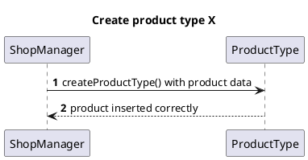

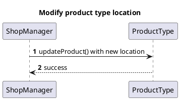

## Manage Users and rights

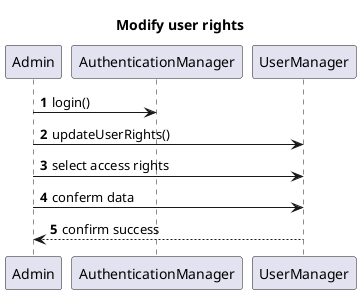

## Manage inventory and orders

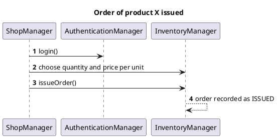

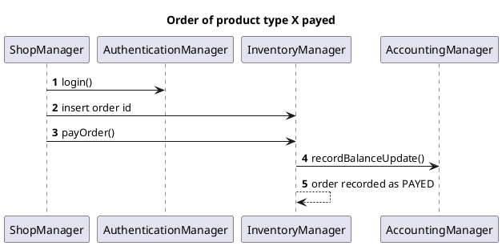

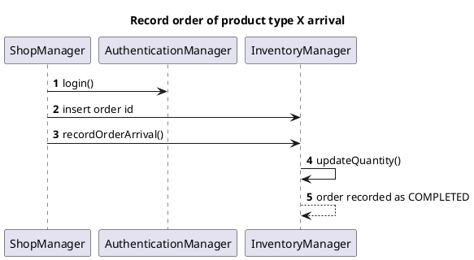

## Manage Customers and Cards

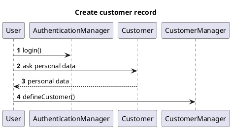

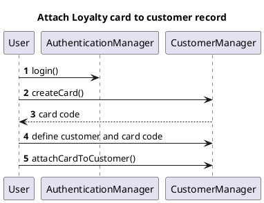

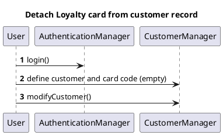

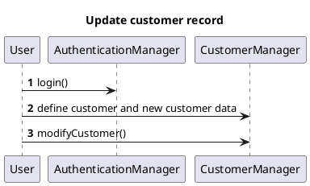

## Manage sale transaction

```plantuml
@startuml Sale of product type X completed
title Sale of product type X completed
autonumber
participant Customer
Cashier -> AuthenticationManager : login()
Cashier -> SaleTransactionManager : startSaleTransaction()
SaleTransactionManager --> Cashier : transaction id
Cashier -> Cashier : read bar code
Cashier -> SaleTransactionManager : addProductToSale() with quantity
SaleTransactionManager -> InventoryManager : updateQuantity()
Cashier -> SaleTransactionManager : closeSaleTransaction() with transaction id
PaymentManager --> Cashier : ask for payment method
Cashier --> Customer : ask for payment method
Customer -> Cashier : choose payment method
Cashier -> PaymentManager : choose payment method
Cashier -> PaymentManager : handle payment
Cashier --> Customer : confirm sale, print sale Ticket
PaymentManager -> AccountingManager : recordBalanceUpdate()
@enduml
```

```plantuml
@startuml Sale of product type X with product discount
title Sale of product type X with product discount
autonumber
participant Customer
Cashier -> AuthenticationManager : login()
Cashier -> SaleTransactionManager : startSaleTransaction()
SaleTransactionManager --> Cashier : transaction id
Cashier -> Cashier : read bar code
Cashier -> SaleTransactionManager : addProductToSale() with quantity
SaleTransactionManager -> InventoryManager : updateQuantity()
Cashier -> SaleTransactionManager : applyDiscountRateToProduct() with rate
Cashier -> SaleTransactionManager : closeSaleTransaction() with transaction id
PaymentManager --> Cashier : ask for payment method
Cashier --> Customer : ask for payment method
Customer -> Cashier : choose payment method
Cashier -> PaymentManager : choose payment method
Cashier -> PaymentManager : handle payment
Cashier --> Customer : confirm sale, print sale Ticket
PaymentManager -> AccountingManager : recordBalanceUpdate()
@enduml
```

```plantuml
@startuml Sale of product type X with sale discount
title Sale of product type X with sale discount
autonumber
participant Customer
Cashier -> AuthenticationManager : login()
Cashier -> SaleTransactionManager : startSaleTransaction()
SaleTransactionManager --> Cashier : transaction id
Cashier -> Cashier : read bar code
Cashier -> SaleTransactionManager : addProductToSale() with quantity
SaleTransactionManager -> InventoryManager : updateQuantity()
Cashier -> SaleTransactionManager : applyDiscountRateToSale() with rate
Cashier -> SaleTransactionManager : closeSaleTransaction() with transaction id
PaymentManager --> Cashier : ask for payment method
Cashier --> Customer : ask for payment method
Customer -> Cashier : choose payment method
Cashier -> PaymentManager : choose payment method
Cashier -> PaymentManager : handle payment
Cashier --> Customer : confirm sale, print sale Ticket
PaymentManager -> AccountingManager : recordBalanceUpdate()
@enduml
```

```plantuml
@startuml Sale of product type X with Loyalty Card update
title Sale of product type X with Loyalty Card update
autonumber
participant Customer
Cashier -> AuthenticationManager : login()
Cashier -> SaleTransactionManager : startSaleTransaction()
SaleTransactionManager --> Cashier : transaction id
Cashier -> Cashier : read bar code
Cashier -> SaleTransactionManager : addProductToSale() with quantity
SaleTransactionManager -> InventoryManager : updateQuantity()
Cashier -> SaleTransactionManager : closeSaleTransaction() with transaction id
PaymentManager --> Cashier : ask for payment method
Cashier --> Customer : ask for payment method
Customer -> Cashier : choose payment method
Cashier -> PaymentManager : choose payment method
Customer --> Cashier : read Fidelity Card serial number
Cashier -> PaymentManager : receiveCreditCardPayment()
SaleTransactionManager -> SaleTransactionManager : computePointsForSale()
SaleTransactionManager -> CustomerManager : updatePointsOnCard()
Cashier --> Customer : confirm sale, print sale Ticket
PaymentManager -> AccountingManager : recordBalanceUpdate()
@enduml
```

```plantuml
@startuml Sale of product type X cancelled
title Sale of product type X cancelled
autonumber
participant Customer
Cashier -> AuthenticationManager : login()
Cashier -> SaleTransactionManager : startSaleTransaction()
SaleTransactionManager --> Cashier : transaction id
Cashier -> Cashier : read bar code
Cashier -> SaleTransactionManager : addProductToSale() with quantity
SaleTransactionManager -> InventoryManager : updateQuantity()
Cashier -> SaleTransactionManager : closeSaleTransaction() with transaction id
PaymentManager --> Cashier : ask for payment method
Cashier --> Customer : ask for payment method
Customer -> Cashier : cancel payment
Cashier -> SaleTransactionManager : endSaleTransaction()
SaleTransactionManager -> SaleTransactionManager : deleteSaleTransaction()
SaleTransactionManager -> InventoryManager : updateQuantity()
@enduml
```

```plantuml
@startuml Sale of product type X completed (cash)
title Sale of product type X completed (cash)
autonumber
participant Customer
Cashier -> AuthenticationManager : login()
Cashier -> SaleTransactionManager : startSaleTransaction()
SaleTransactionManager --> Cashier : transaction id
Cashier -> Cashier : read bar code
Cashier -> SaleTransactionManager : addProductToSale() with quantity
SaleTransactionManager -> InventoryManager : updateQuantity()
Cashier -> SaleTransactionManager : closeSaleTransaction() with transaction id
PaymentManager --> Cashier : ask for payment method
Cashier --> Customer : ask for payment method
Customer -> Cashier : choose cash payment
Cashier -> PaymentManager : choose cash payment
Cashier -> SaleTransactionManager : receiveCashPayment()
Cashier --> Customer : confirm sale, print sale Ticket
PaymentManager -> AccountingManager : recordBalanceUpdate()
@enduml
```

## Manage payment

```plantuml
@startuml Manage payment by valid credit card
title Manage payment by valid credit card
autonumber
Customer --> Cashier : read credit card
Cashier -> PaymentManager : validate card with Luhn Algorithm
PaymentManager -> PaymentManager : receiveCreditCardPayment()
PaymentManager --> Cashier : exit with success
@enduml
```

```plantuml
@startuml Manage payment by invalid credit card
title Manage payment by invalid credit card
autonumber
Customer --> Cashier : read credit card
Cashier -> PaymentManager : validate card with Luhn Algorithm
EZshopException -> PaymentManager : InvalidCreditCardException()
PaymentManager --> Cashier : issue warning, exit with error
@enduml
```

```plantuml
@startuml Manage credit card payment with not enough credit
title Manage credit card payment with not enough credit
autonumber
Customer --> Cashier : read credit card
Cashier -> PaymentManager : validate card with Luhn Algorithm
PaymentManager -> PaymentManager : receiveCreditCardPayment()
EZshopException -> PaymentManager : InvalidCreditCardException()
PaymentManager --> Cashier : issue warning, exit with error
@enduml
```

```plantuml
@startuml Manage cash payment
title Manage cash payment
autonumber
Customer --> Cashier : Collect banknotes and coins
Cashier --> PaymentManager : compute cash quantity
PaymentManager -> PaymentManager : receiveCashPayment()
PaymentManager -> PaymentManager : compute change amount
PaymentManager --> Cashier : change amount
Cashier --> Customer : give change
PaymentManager -> AccountingManager : recordBalanceUpdate()
@enduml
```

## Manage return transaction

```plantuml
@startuml Return transaction of product type X completed, credit card
title Return transaction of product type X completed, credit card
autonumber
Cashier -> AuthenticationManager : login()

Cashier -> SaleTransactionManager : startReturnTransaction() with transaction id
SaleTransactionManager --> Cashier : return transaction id
Cashier -> Cashier : read bar code
Cashier -> SaleTransactionManager : returnProduct() with quantity
SaleTransactionManager -> InventoryManager : updateQuantity()
Cashier -> SaleTransactionManager : closeSaleTransaction() with transaction id
Cashier -> SaleTransactionManager : handle credit card return
SaleTransactionManager -> SaleTransactionManager : returnCreditCardPayment()
Cashier -> SaleTransactionManager : endReturnTransaction()
PaymentManager -> AccountingManager : recordBalanceUpdate()
@enduml
```

```plantuml
@startuml Return transaction of product type X completed, cash
title Return transaction of product type X completed, cash
autonumber
Cashier -> AuthenticationManager : login()

Cashier -> SaleTransactionManager : startReturnTransaction() with transaction id
SaleTransactionManager --> Cashier : return transaction id
Cashier -> Cashier : read bar code
Cashier -> SaleTransactionManager : returnProduct() with quantity
SaleTransactionManager -> InventoryManager : updateQuantity()
Cashier -> SaleTransactionManager : closeSaleTransaction() with transaction id
Cashier -> SaleTransactionManager : handle cash return
Cashier -> SaleTransactionManager : returnCashPayment()
Cashier -> SaleTransactionManager : endReturnTransaction()
PaymentManager -> AccountingManager : recordBalanceUpdate()
@enduml
```

## Accounting

```plantuml
@startuml List credits and debits
title List credits and debits
autonumber
ShopManager -> AuthenticationManager : login()
ShopManager -> AccountingManager : getCreditsAndDebits()\nwith starting date and ending date
AccountingManager --> ShopManager : display transactions list
@enduml
```

## Manage return

```plantuml
@startuml Return payment by  credit card
title Return payment by  credit card
autonumber
Customer --> Cashier : read credit card
Cashier -> PaymentManager : validate card with Luhn Algorithm
PaymentManager -> PaymentManager : returnCreditCardPayment() with amount
PaymentManager --> Cashier : exit with success
PaymentManager -> AccountingManager : recordBalanceUpdate()
@enduml
```

```plantuml
@startuml Return cash payment
title Return cash payment
autonumber
participant Customer
Cashier -> PaymentManager : returnCashPayment()
PaymentManager --> Cashier : returna amount
Cashier -> Cashier : collect banknotes and coins
Cashier --> Customer : return cash
PaymentManager -> AccountingManager : recordBalanceUpdate()
@enduml
```
