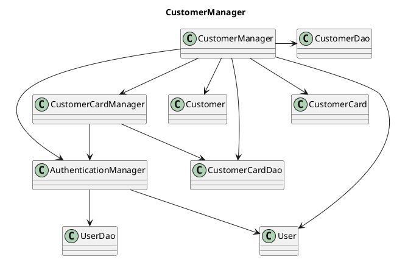
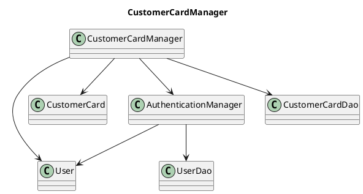
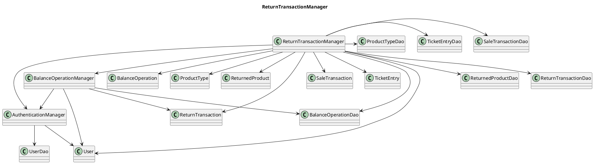
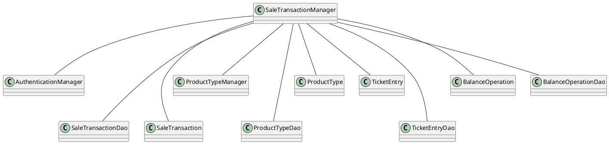
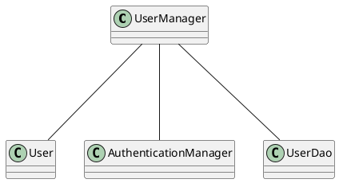
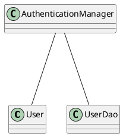

# Integration and API Test Documentation

Authors:

Date:

Version:

# Contents

- [Dependency graph](#dependency graph)

- [Integration approach](#integration)

- [Tests](#tests)

- [Scenarios](#scenarios)

- [Coverage of scenarios and FR](#scenario-coverage)
- [Coverage of non-functional requirements](#nfr-coverage)

# Dependency graph







# Order Manager

```plantuml

class OrderManager
class OrderDao
class AuthenticationManager
class ProductTypeManager
class ProductType
class Order

OrderManager ---- ProductType
OrderManager ---- Order
OrderManager --- OrderDao
OrderManager --- AuthenticationManager
OrderManager --- ProductTypeManager
OrderManager ---- BalanceOperationManager


```

# Product Type Manager

```plantuml

class ProductTypeManager
class ProductTypeDao
class AuthenticationManager
class ProductType

ProductTypeManager --- ProductType
ProductTypeManager --- AuthenticationManager
ProductTypeManager --- ProductTypeDao


```

# Balance Operation Manager

```plantuml

class BalanceOperationManager
class BalanceOperation
class AuthenticationManager
class BalanceOperationDao


BalanceOperationManager --- BalanceOperation
BalanceOperationManager --- AuthenticationManager
BalanceOperationManager --- BalanceOperationDao

```



##UserManager



##AuthenticationManager



# Integration approach

    <Write here the integration sequence you adopted, in general terms (top down, bottom up, mixed) and as sequence
    (ex: step1: class A, step 2: class A+B, step 3: class A+B+C, etc)>
    <Some steps may  correspond to unit testing (ex step1 in ex above), presented in other document UnitTestReport.md>
    <One step will  correspond to API testing>

# Tests

<define below a table for each integration step. For each integration step report the group of classes under test, and the names of
JUnit test cases applied to them> JUnit test classes should be here src/test/java/it/polito/ezshop

##SaleTransactionManager

## Step 1

| Classes               | JUnit test cases          |
| --------------------- | ------------------------- |
| AuthenticationManager | TestAuthenticationManager |

## Step 2

| Classes            | JUnit test cases |
| ------------------ | ---------------- |
| ProductTypeManager | TestProductType  |

## Step 3

| Classes            | JUnit test cases |
| ------------------ | ---------------- |
| SaleTransactionDao | nomeTest         |

## Step 4

| Classes        | JUnit test cases |
| -------------- | ---------------- |
| ProductTypeDao | nomeTest         |

## Step 5

| Classes        | JUnit test cases |
| -------------- | ---------------- |
| TicketEntryDao | nomeTest         |

## Step 6

| Classes             | JUnit test cases |
| ------------------- | ---------------- |
| BalanceOperationDao | nomeTest         |

## Step 7

| Classes                                                                                                                              | JUnit test cases |
| ------------------------------------------------------------------------------------------------------------------------------------ | ---------------- |
| AuthenticationManager,ProductTypeManager,SaleTransactionDao,ProductTypeDao,TicketEntryDao,BalanceOperationDao,SaleTransactionManager | nomeTest         |

##UserManager

## Step 1

| Classes               | JUnit test cases          |
| --------------------- | ------------------------- |
| AuthenticationManager | TestAuthenticationManager |

## Step 2

| Classes | JUnit test cases |
| ------- | ---------------- |
| UserDao | nomeTest         |

## Step 3

| Classes                                   | JUnit test cases |
| ----------------------------------------- | ---------------- |
| AuthenticationManager,UserDao,UserManager | nomeTest         |

##AuthenticationManager

## Step 1

| Classes | JUnit test cases |
| ------- | ---------------- |
| UserDao | nomeTest         |

## Step 2

| Classes                       | JUnit test cases |
| ----------------------------- | ---------------- |
| AuthenticationManager,UserDao | nomeTest         |

# OrderManager

## Step 1

| Classes               | JUnit test cases |
| --------------------- | ---------------- |
| AuthenticationManager | nome test        |

## Step 2

| Classes            | JUnit test cases |
| ------------------ | ---------------- |
| ProductTypeManager | nome test        |

## Step 3

| Classes  | JUnit test cases |
| -------- | ---------------- |
| OrderDao | nome test        |

## Step 4

| Classes                 | JUnit test cases |
| ----------------------- | ---------------- |
| BalanceOperationManager | nome test        |

## Step 4

| Classes                                                                         | JUnit test cases |
| ------------------------------------------------------------------------------- | ---------------- |
| OrderManager, ProductTypeManager,BalanceOperationManager, AuthenticationManager | nome test        |

# ProductTypeManager

## Step 1

| Classes               | JUnit test cases |
| --------------------- | ---------------- |
| AuthenticationManager | nome test        |

## Step 2

| Classes        | JUnit test cases |
| -------------- | ---------------- |
| ProductTypeDao | nome test        |

## Step 3

| Classes                                                  | JUnit test cases |
| -------------------------------------------------------- | ---------------- |
| ProductTypeManager, AuthenticationManager,ProductTypeDao | nome test        |

## BalanceOperationManager

## Step 1

| Classes               | JUnit test cases |
| --------------------- | ---------------- |
| AuthenticationManager | nome test        |

## Step 2

| Classes             | JUnit test cases |
| ------------------- | ---------------- |
| BalanceOperationDao | nome test        |

## Step 3

| Classes                                                            | JUnit test cases |
| ------------------------------------------------------------------ | ---------------- |
| BalanceOperationManager, AuthenticationManager,BalanceOperationDao | nome test        |

# Integration approach

    <Write here the integration sequence you adopted, in general terms (top down, bottom up, mixed) and as sequence
    (ex: step1: class A, step 2: class A+B, step 3: class A+B+C, etc)>
    <Some steps may  correspond to unit testing (ex step1 in ex above), presented in other document UnitTestReport.md>
    <One step will  correspond to API testing>

# Tests

<define below a table for each integration step. For each integration step report the group of classes under test, and the names of
JUnit test cases applied to them> JUnit test classes should be here src/test/java/it/polito/ezshop

# Customer Manager

## Step 1

| Classes         | JUnit test cases                            |
| --------------- | ------------------------------------------- |
| UserDao         | TestEZShopDao<br/>-->test_UserDao()         |
| CustomerDao     | TestEZShopDao<br/>-->test_CustomerDao()     |
| CustomerCardDao | TestEZShopDao<br/>-->test_CustomerCardDao() |

## Step 2

| Classes                            | JUnit test cases |
| ---------------------------------- | ---------------- |
| AuthenticationManager<br/>+UserDao |                  |

## Step 3

| Classes                                                             | JUnit test cases                              |
| ------------------------------------------------------------------- | --------------------------------------------- |
| CustomerCardManager<br/>+AuthenticationManager<br/>+CustomerCardDao | TestEZShopFG <br/>--> TestCustomerCardManager |

## Step 4

| Classes                                                                                                   | JUnit test cases                          |
| --------------------------------------------------------------------------------------------------------- | ----------------------------------------- |
| CustomerManager<br/>+CustomerCardManager<br/>+AuthenticationManager<br/>+CustomerCardDao<br/>+CustomerDao | TestEZShopFG <br/>--> TestCustomerManager |

# Customer Card Manager

## Step 1

| Classes         | JUnit test cases                            |
| --------------- | ------------------------------------------- |
| UserDao         | TestEZShopDao<br/>-->test_UserDao()         |
| CustomerCardDao | TestEZShopDao<br/>-->test_CustomerCardDao() |

## Step 2

| Classes                            | JUnit test cases |
| ---------------------------------- | ---------------- |
| AuthenticationManager<br/>+UserDao |                  |

## Step 3

| Classes                                                             | JUnit test cases                              |
| ------------------------------------------------------------------- | --------------------------------------------- |
| CustomerCardManager<br/>+AuthenticationManager<br/>+CustomerCardDao | TestEZShopFG <br/>--> TestCustomerCardManager |

# Return Transaction Manager

## Step 1

| Classes              | JUnit test cases                                 |
| -------------------- | ------------------------------------------------ |
| TicketEntryDao       | TestEZShopDao<br/>--> test_TicketEntryDao()      |
| SaleTransactionDao   | TestEZShopDao<br/>-->test_SaleTransactionDao()   |
| ReturnTransactionDao | TestEZShopDao<br/>-->test_ReturnTransactionDao() |
| ReturnedProductDao   | TestEZShopDao<br/>-->test_ReturnedProductDao()   |
| ProductTypeDao       | TestEZShopDao<br/>-->test_ProductTypeDao()       |
| UserDao              | TestEZShopDao<br/>-->test_UserDao()              |
| BalanceOperationDao  | TestEZShopDao<br/>-->test_BalanceOperationDao()  |

## Step 2

| Classes                            | JUnit test cases |
| ---------------------------------- | ---------------- |
| AuthenticationManager<br/>+UserDao |                  |

## Step 3

| Classes                                                                     | JUnit test cases |
| --------------------------------------------------------------------------- | ---------------- |
| BalanceOperationManager<br/>+AuthenticationManager<br/>+BalanceOperationDao |                  |

## Step 4

| Classes                                                                                            | JUnit test cases                                   |
| -------------------------------------------------------------------------------------------------- | -------------------------------------------------- |
| ReturnTransactionManager<br/>+BalanceOperationManager<br/>+AuthenticationManager<br/>+(above Daos) | TestEZShopFG <br/>--> TestReturnTransactionManager |

# Coverage of Scenarios and FR

<Report in the following table the coverage of scenarios (from official requirements and from above) vs FR.
Report also for each of the scenarios the (one or more) API JUnit tests that cover it. >

| Scenario ID | Functional Requirements covered | JUnit Test(s) |
| ----------- | ------------------------------- | ------------- |
| UC1         | FR3, FR1                        | TestEZShop<br/>-->TestProductTypeManager           |              
| UC2         | FR1                             | TestEZShop<br/>-->TestUserManager                  |
|             |                                 | TestEZShop<br/>-->TestAuthenticationManager        |
| UC3         | FR4, FR3, FR1                   | TestEZShop<br/>-->TestOrderManager                 |
| UC4         | FR5, FR1                        | TestEZShop<br/>-->TestCustomerManager              |
|             |                                 | TestEZShop<br/>-->TestCustomerCardManager          |
| UC5         | FR1                             | TestEZShop<br/>-->TestAuthenticationManager        |
| UC6         | FR1, FR3, FR6                   | TestEZShop<br/>-->TestSaleTransactionManager       |
|             |                                 | TestEZShop<br/>-->TestTicketEntryManager           |
| UC7         | FR7, FR8                        | TestEZShop<br/>-->TestSaleTransactionManager       |
| UC8         | FR1, FR3, FR6                   | TestEZShop<br/>-->TestReturnTransactionManager     |
| UC9         | FR7, FR8                        | TestEZShop<br/>-->TestReturnTransactionManager     |


# Coverage of Non Functional Requirements

<Report in the following table the coverage of the Non Functional Requirements of the application - only those that can be tested with automated testing frameworks.>

###

| Non Functional Requirement | Test name |
| -------------------------- | --------- |
|                            |           |
