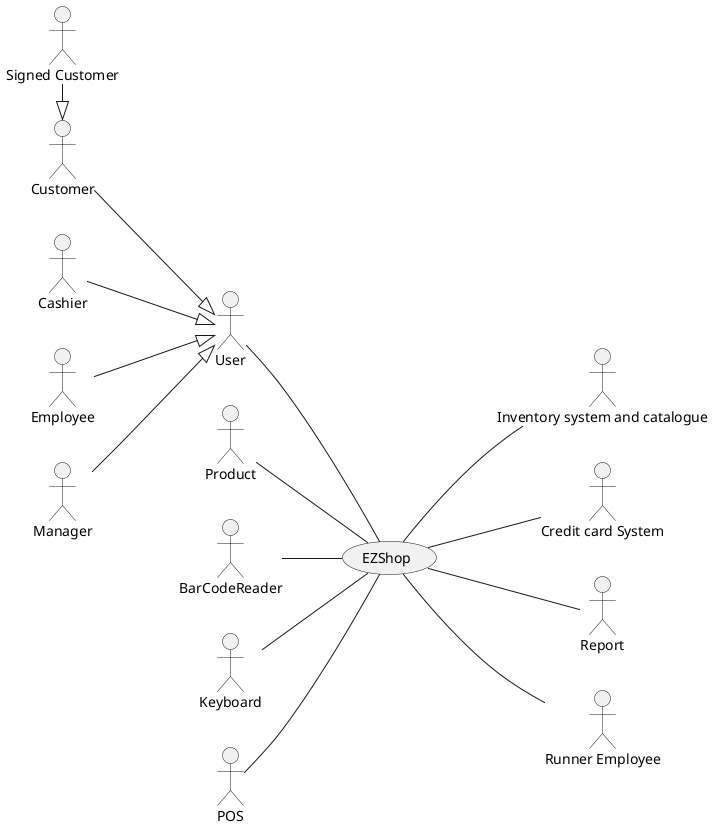
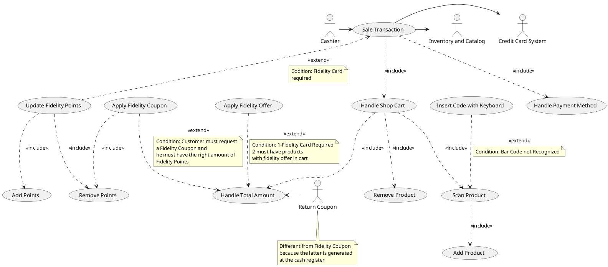
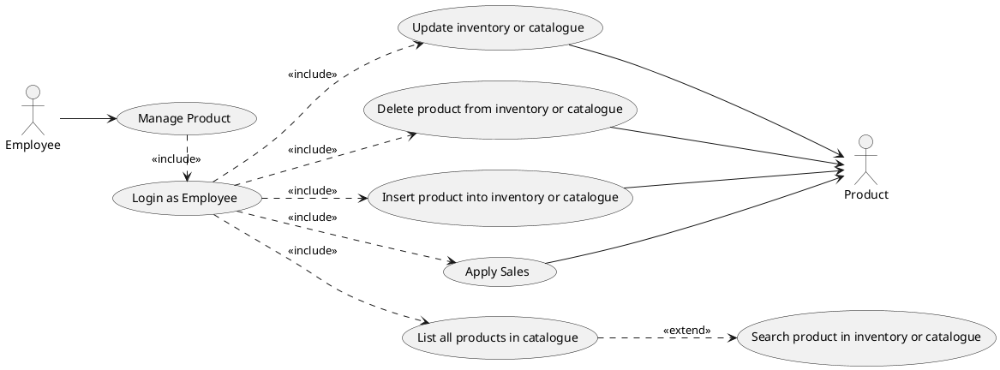
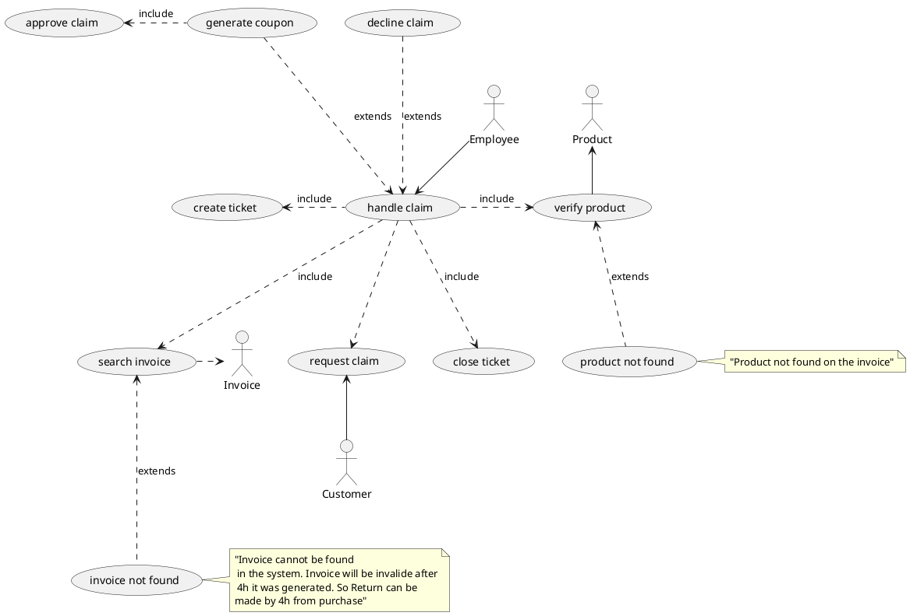
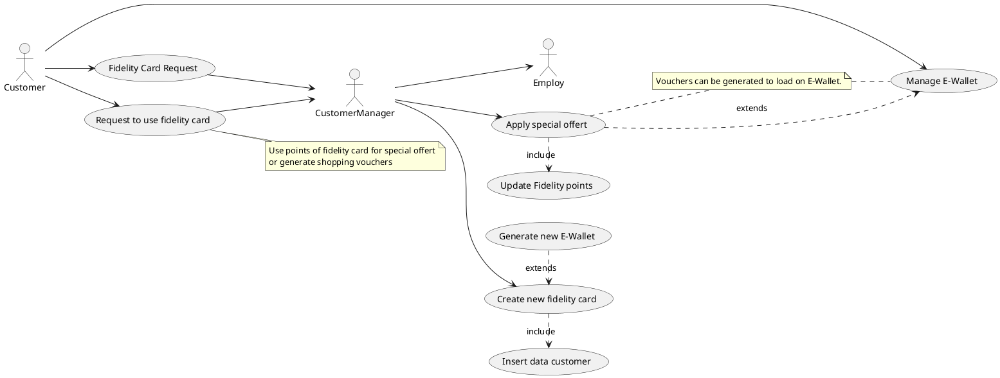
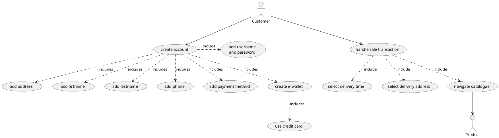
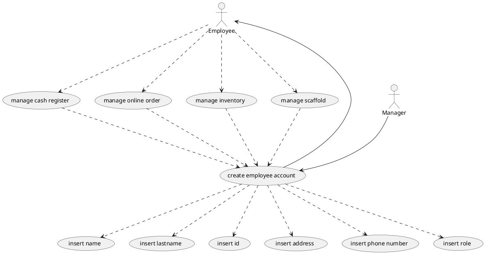
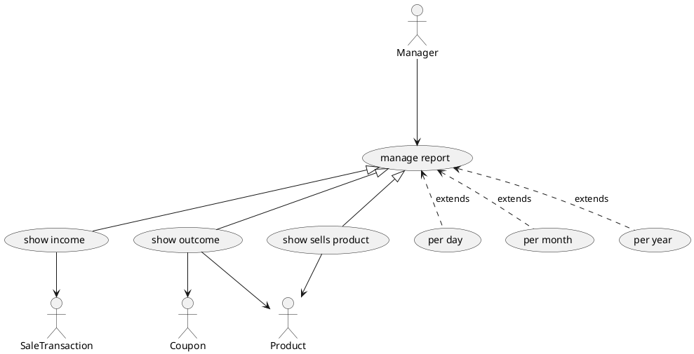
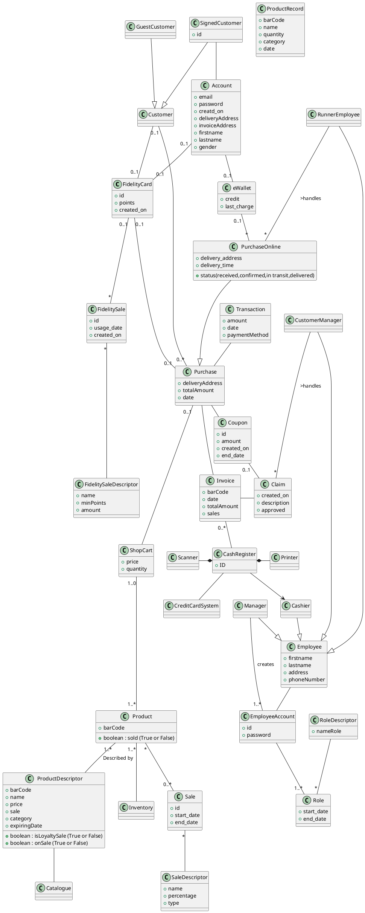
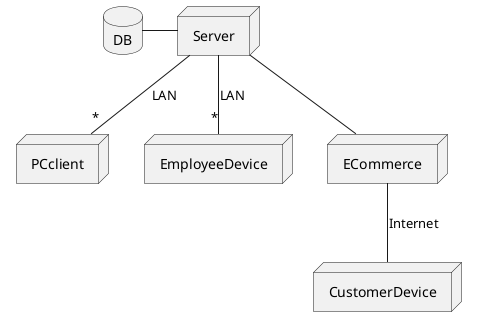

# Requirements Document

Authors: Florin Gheorghiu, Alberto Cipollina, Simone De Stefano

Date: 21/04/2021

Version: 1

# Contents

- [Essential description](#essential-description)
- [Stakeholders](#stakeholders)
- [Context Diagram and interfaces](#context-diagram-and-interfaces)
  - [Context Diagram](#context-diagram)
  - [Interfaces](#interfaces)
- [Stories and personas](#stories-and-personas)
- [Functional and non functional requirements](#functional-and-non-functional-requirements)
  - [Functional Requirements](#functional-requirements)
  - [Non functional requirements](#non-functional-requirements)
- [Use case diagram and use cases](#use-case-diagram-and-use-cases)
  - [Use case diagram](#use-case-diagram)
    - [Physical sale transaction](#physical-sale-transaction)
    - [Manage Products](#manage-products)
    - [Manage claim](#manage-claim)
    - [Manage customer fidelity](#manage-customer-fidelity)
    - [Manage shop online](#manage-shop-online)
    - [Manage employee](#manage-employee)
    - [Manage accounting](#manage-accounting)
  * [Use cases](#use-cases) + [Relevant scenarios](#relevant-scenarios)
- [Glossary](#glossary)
- [System design](#system-design)
- [Deployment diagram](#deployment-diagram)

# Essential description

Small shops require a simple application to support the owner or manager. A small shop (ex a food shop) occupies 50-200 square meters, sells 500-2000 different item types, has one or a few cash registers
EZShop is a software application to:

- manage sales
- manage inventory
- manage customers
- support accounting

# Stakeholders

| Stakeholder name      |                                               Description                                                |
| --------------------- | :------------------------------------------------------------------------------------------------------: |
| Manager               |                           person who manages shop, can apply sales to products                           |
| Signed Customer       |                                      signed up customer (Fidelity)                                       |
| Guest Customer        |                                          customer not signed up                                          |
| Employee              |                                         manages shop's scaffold                                          |
| Runner Employee       |                               employee who delivers products to customers                                |
| Accounting manager    |                               who monitors sales, top sells, daily income                                |
| Owner                 |                                            Owner of all shops                                            |
| IT manager            |                          responsible of application, (manages possible issues)                           |
| Supplier              |                                        who supplies missing items                                        |
| Cashier               |                                        employee at cash register                                         |
| Customer Maintainance | information point, can manage returns, give information about product place, manage registration of user |

# Context Diagram and interfaces

## Context Diagram

## Interfaces

| Actor                 |   Logical Interface    |               Physical Interface |
| --------------------- | :--------------------: | -------------------------------: |
| Cashier               |        Web GUI         | cash register, physical keyboard |
| Employee              |        Web GUI         |                      Smart phone |
| Runner Employee       |        Web GUI         |                      Smart phone |
| Customer Maintainance |        Web GUI         |                           Tablet |
| Accounting manager    | Web GUI with Dashboard |                           Tablet |
| Manager               |        Web GUI         |                           Tablet |
| Signed Customer       |        Web GUI         |          Smart phone, PC, Tablet |
| Guest Customer        |        Web GUI         |          Smart phone, PC, Tablet |

# Stories and personas

**PERSONA 1**
Marco, middle-age male, shop manager.

Marco is a shop manager who has been recently employed in a new grocery shop and is searching for an all in one software solution that could make managing the shop easier. He has various tasks, such as keeping track of the various employees of the shop he's managing, of the incomes and outcomes and managing offers. He would also like to make some kind of fidelity program for his customer, so they would have more reasons to buy from the shop he's working in. He also needs to be able to have a general overview of the best and worst selling items, so he can maximize profit and minimize the losses.
After some research he also finds out that the area is inhabited by many elderlies, who are not always able to go out and do grocery shopping, so Marco also wants to offer delivery services.
He would also like to have an easy way to manage the inventory and catalogue, and a simple and intuitive interface for the cash registers and the customer management system, so the employees would be able to easily learn how to use those, without much training.

**Goals:**
_-Wants to be able to easily manage employees and their accounts (creation, editing and removal)
-Wants to easily keep track of incomes and outcomes 
-Wants to have an overview on the accounting part
-Needs some kind of a fidelity program
-Wants to offer delivery sevices
-He wants an all in one solution with simple and intuitive interfaces_

**PERSONA 2**
Genoveffa, middle-age female, mother of four, average income.

Genoveffa, as a mother of four, needs to go grocery shopping very often, so she wants to be able to waste as little time as possible. She has a new grocery shop near her and she found out that it has a fidelity program and, if she agrees to it, she will have access to many special offers and the more she buys from there, the better the offers get, so she would be very interested. The program also has a points system, that can be accumulated by buying from the store and can then be spent to get coupons. She also learned that she can create an account and have access to an e-wallet on which she can put her various coupons, including the ones that she gets from returned items, which is very convenient and time saving, since she doesn't always have to remember to take her coupons with her.
Being able to pay with a credit card is a very comfortable and time saving plus.

**Goals:**
_-She needs a convenient grocery shop
-Wants to spend as little time as possible
-She wants a simple way to use coupons_

**PERSONA 3**
Rosalba, old-age female, unemployed, lives alone.

Rosalba is an old lady who lives alone and is not able to move very well, but fortunately she found out that there is a grocery shop that offers delivery services. The delivery orders can be made online and the process is very intuitive, so she is able to make them alone without any help.

**Goals:**
_-She wants deliveries in reasonable times
-She wants simple an intuitive way to place orders_

**PERSONA 4**
Gianlorenzo, middle-age male, customer manager, father of two.

Gianlorenzo is a customer manager that works in a grocery shop that has a fidelity program, so the customers must be able to create a fidelity card and an account. Therefore he wants to be able to easily create and manage accounts and he would also like a simple and intuitive interface for the customer, so he doesn't have to explain too much. Since the program also has a points system that allow the customers to request fidelity coupons, he would like a simple way to generate them.
He's also responsible for the return of items and generation of return coupons, so he needs a fast and reliable way to see if the return is valid and to generate the return coupon.

**Goals:**
_-He needs a simple way to manage and create customer accounts
-He wants a fast process for the management of returns
-He would like to easily handle the fidelity system_

# Functional and non functional requirements

## Functional Requirements

| ID      |                      Description                       |
| ------- | :----------------------------------------------------: |
| **FR1** |              **Handle sale transaction**               |
| FR1.1   |                    open transaction                    |
| FR1.2   |                add product to shop cart                |
| FR1.3   |                 update total shop cart                 |
| FR1.4   |                   confirm shop cart                    |
| FR1.5   |                 choose payment method                  |
| FR1.6   |                     handle payment                     |
| FR1.7   |                   invoice generation                   |
| FR1.8   |     printing invoice (only for physical purchase)      |
| FR1.9   |                   close transaction                    |
| **FR2** |                  **Manage employee**                   |
| FR2.1   |       Create new account (customer and employee)       |
| FR2.2   |                     Delete account                     |
| FR2.3   |                     Modify account                     |
| FR2.4   |                      Search user                       |
| FR2.5   |                     List all user                      |
| FR2.6   |                  Login(Id + password)                  |
| FR2.7   |                 Check account and role                 |
| FR2.8   |                         Logout                         |
| **FR3** |                  **Manage products**                   |
| FR3.1   |              Insert product to inventory               |
| FR3.2   |              Insert product to catalogue               |
| FR3.3   |              Delete product to inventory               |
| FR3.4   |              Delete product to catalogue               |
| FR3.5   |                    Update inventory                    |
| FR3.6   |                    Update catalogue                    |
| FR3.7   |                      Apply sales                       |
| FR3.8   |              Search product in inventory               |
| FR3.9   |              Search product in catalogue               |
| FR3.10  |             List all product in catalogue              |
| **FR4** |                  **Manage customer**                   |
| FR4.1   |                  Create fidelity card                  |
| FR4.2   |                  Apply special offers                  |
| FR4.3   |                 Update fidelity points                 |
| FR4.4   |                 Update fidelity level                  |
| FR4.5   |                   open claim ticket                    |
| FR4.6   |                     check invoice                      |
| FR4.7   |              check and validation product              |
| FR4.8   | generation of coupon of same cost of product and print |
| FR4.9   |                   close claim ticket                   |
| **FR5** |                 **Manage accounting**                  |
| FR5.1   |             Update income after every sale             |
| FR5.2   |       Update outcome after registration of a lot       |
| FR5.3   |      List number of returns per day, month, year       |
| FR5.4   |       List number of sales per day, month, year        |
| FR5.5   |  Search and sort best/worst buy per day, month, year   |
| FR5.6   |                 Dashboard for manager                  |
| FR5.7   |         Generate daily, monthly, yearly report         |
| **FR6** |                 **Manage Shop online**                 |
| FR6.1   |                   Navigate catalogue                   |
| FR6.2   |                    handle shop cart                    |
| FR6.3   |                      handle login                      |
| FR6.4   |                  handle registration                   |
| FR6.5   |                  save payment method                   |
| FR6.6   |                      buy products                      |
| FR6.7   |                 choose delivery method                 |
| FR6.8   |                  select delivery time                  |
| FR6.9   |                    charge e-wallet                     |
| FR6.10  |                    create e-wallet                     |
| FR6.11  |                    delete e-wallet                     |
| FR6.12  |                Insert delivery address                 |
| FR6.13  |                    Confirm delivery                    |
| FR6.14  |                     Start delivery                     |
| FR6.15  |                      End delivery                      |
| FR6.16  |                 select payment method                  |
| FR6.17  |                     delete account                     |

## Non Functional Requirements

| ID   | Type (efficiency, reliability, ..) |                                                                                                                     Description                                                                                                                     |                Refers to |
| ---- | :--------------------------------: | :-------------------------------------------------------------------------------------------------------------------------------------------------------------------------------------------------------------------------------------------------: | -----------------------: |
| NFR1 |             Usability              |                                                                                                Effort required to uses in order to use all function                                                                                                 |      FR1,FR2,FR5,FR6,FR7 |
| NFR2 |             Efficiency             |                                                                              All function less than 0.5 sec , except FR1.8 because depend by number purchased product                                                                               |                      FR1 |
| NFR3 |             Efficiency             |                                                                                                            All function less than 1 sec                                                                                                             |                  FR2,FR5 |
| NFR4 |             Efficiency             |                                                                                                            All funtions less than 3 sec                                                                                                             | All FR, except F1 and F2 |
| NFR5 |            Portability             | The application should be accessed by Chrome, Safari,Firefox , Edge and from the operating systems where these browsers are available (Android, IoS, Windows, MacOS). As for devices, the application should be usable on smartphones,PC and Tablet |                   All FR |
| NFR6 |              Privacy               |                                                                                           different domain name for EZShop between employee and customers                                                                                           |                   All FR |
| NFR7 |              Privacy               |                                         The data of one user should not be disclosed to other users. The identity of the user who signaled or assessed a price report should not be visible to other users                                          |                   All FR |
| NFR8 |            Reliability             |                                                                  No error during execution and in case of failure save of shop cart in order to not restart operation from scratch                                                                  |                      FR1 |

# Use case diagram and use cases

## Use case diagram

## Physical sale transaction

## Manage Products

## Manage claim

## Manage customer fidelity

## Manage shop online

## Manage employee

## Manage accounting

## Physical Sale Transaction

### Use case 1, Scan Product

| Actors Involved  | Cashier, Product                                                                     |
| ---------------- | :------------------------------------------------------------------: |
| Precondition     | Cashier must be logged in, opened sale transaction |
| Post condition   | Shop cart Updated and not empty, total amount updated (>0) |
| Nominal Scenario |         Cashier adds product to shop cart with bar code reader   |
| Variants         |              Cashier adds product with keyboard  |

##### Scenario 1.1

| Scenario 1.1   | Bar code not readable                                                                           |
| -------------- | :------------------------------------------------------------------------: |
| Precondition   | Cashier must be logged in, opened sale transaction |
| Post condition |  Shop cart Updated and not empty, total amount updated (>0)   |
| Step#          |                                Description                                 |
| 1              |  Cashier scans product                                 |
| 2              |  Product bar code is not correctly read by the bar code reader                  |
| 3              |  Cashier inserts product code by keyboard from the cash register                    |
| 4              |  Product added successfully to the shop cart                    |

### Use case 2, Add Product

| Actors Involved  | Cashier, Product                                                                     |
| ---------------- | :------------------------------------------------------------------: |
| Precondition     | Cashier must be logged in, opened sale transaction |
| Post condition   | Shop cart Updated and not empty, total amount updated (>0) |
| Nominal Scenario |         Cashier adds product to shop cart with bar code reader   |
| Variants         |              Cashier adds product with keyboard  |

### Use case 3, Remove Product
| Actors Involved  | Cashier, Product                                                                     |
| ---------------- | :------------------------------------------------------------------: |
| Precondition     | Cashier must be logged in, opened sale transaction, shop cart not empty |
| Post condition   | Shop cart updated, total amount updated |
| Nominal Scenario | Cashier removes product from shop cart using GUI   |
| Variants         |  - |

### Use case 4, Add Points
| Actors Involved  | Cashier                                                                    |
| ---------------- | :------------------------------------------------------------------: |
| Precondition     | Cashier must be logged in, opened sale transaction, shop cart not empty, valid fidelity card |
| Post condition   | Total amount updated (lower than previous amount and >0), fidelity points updated (higher than previous amount and >=0)|
| Nominal Scenario | Points Added successfully|
| Variants         | Invalid fidelity card code |

### Use case 5, Remove Points
| Actors Involved  | Cashier                                                                    |
| ---------------- | :------------------------------------------------------------------: |
| Precondition     | Cashier must be logged in, opened sale transaction, shop cart not empty, valid fidelity card, minimum amount of required fidelity points |
| Post condition   | Total amount updated (lower than previous amount and >0), fidelity points updated (lower than previous amount and >=0)|
| Nominal Scenario | Points Removed successfully|
| Variants         | Invalid fidelity card code |

### Use case 6, Apply Fidelity Offer
| Actors Involved  | Cashier                                                                    |
| ---------------- | :------------------------------------------------------------------: |
| Precondition     | Cashier must be logged in, opened sale transaction, shop cart not empty, valid fidelity card, product must have fidelity offer |
| Post condition   | Total amount updated (lower than previous amount and >0)|
| Nominal Scenario | Fidelity offer applied on the products|
| Variants         | Invalid fidelity card code |

##### Scenario 6.1

| Scenario 6.1   |  Products don't have fidelity offer                                        |
| -------------- | :------------------------------------------------------------------------: |
| Precondition   | Cashier must be logged in, opened sale transaction, shop cart not empty, valid fidelity card |
| Post condition | Same total amount |
| Step#          |                                Description                                 |
| 1              | Scan fidelity card                                                                           |
| 2              | Scan product                                                     |
| 3              | No products with fidelity offer found                                                 |
| 4              | Repeat 2 for all products                                                |

##### Scenario 6.2

| Scenario 6.2   | Invalid fidelity card                                        |
| -------------- | :------------------------------------------------------------------------: |
| Precondition   | Cashier must be logged in, opened sale transaction, shop cart not empty |
| Post condition | Same total amount   |
| Step#          |                                Description                                 |
| 1              | Scan fidelity card                                                                           |
| 2              | Fidelity card declined                                                   |

### Use case 7, Apply Fidelity Coupon
| Actors Involved  | Cashier                                                                    |
| ---------------- | :------------------------------------------------------------------: |
| Precondition     | Cashier must be logged in, opened sale transaction, shop cart not empty, valid fidelity card, minimum amount of required fidelity points |
| Post condition   | Total amount updated (lower than previous amount and >0), fidelity points updated (lower than previous amount and >=0)|
| Nominal Scenario | Fidelity coupon applied, fidelity points removed successfully|
| Variants         | Invalid fidelity card code |

##### Scenario 7.1

| Scenario 7.1   | Not enough fidelity points                                      |
| -------------- | :------------------------------------------------------------------------: |
| Precondition   | Cashier must be logged in, opened sale transaction, shop cart not empty, valid fidelity card |
| Post condition | Same total amount, same fidelity points amount   |
| Step#          |                                Description                                 |
| 1              | Scan fidelity card                                                                           |
| 2              | Check if enough fidelity points for coupon                                                  |
| 3              | Not enough fidelity points, coupon declined                                                 |

##### Scenario 7.2

| Scenario 7.2   | Invalid fidelity card                                        |
| -------------- | :------------------------------------------------------------------------: |
| Precondition   | Cashier must be logged in, opened sale transaction, shop cart not empty |
| Post condition | Same total amount   |
| Step#          |                                Description                                 |
| 1              | Scan fidelity card                                                                           |
| 2              | Fidelity card declined                                                   |

### Use case 8, Handle Payment
| Actors Involved  | Cashier, Credit Card System                                                                    |
| ---------------- | :------------------------------------------------------------------: |
| Precondition     | Cashier must be logged in, opened sale transaction, shop cart not empty, customer has enough money for payment |
| Post condition   | Successful payment, invoice generated |
| Nominal Scenario | Customer successfully pays |
| Variants         | Credit Card Declined -> cash payment required |

##### Scenario 8.1

| Scenario 8.1   | Credit card declined, not enough cash                                        |
| -------------- | :------------------------------------------------------------------------: |
| Precondition   | Cashier must be logged in, opened sale transaction, shop cart not empty |
| Post condition | Transaction declined  |
| Step#          |                                Description                                 |
| 1              | Attempt credit card payment                            |
| 2              | Credit card declined                                                   |
| 3              | Cash payment required                                                   |
| 4              | Not enough cash                                                  |
| 5              | Transaction declined                                                  |

### Use case 9, Sale Transaction
| Actors Involved  | Cashier, Credit Card System, Inventory and Catalog System                            |
| ---------------- | :------------------------------------------------------------------: |
| Precondition     | Cashier must be logged in, new sale transaction successfully opened |
| Post condition   | Payment successful, invoice generated, inventory and catalog successfully updated, closed sale transaction |
| Nominal Scenario | Customer successfully pays, invoice is generated and printed |
| Variants         | - |

## Manage Products

### Use case 1, Insert product into inventory or catalogue
| Actors Involved  | Employee                            |
| ---------------- | :------------------------------------------------------------------: |
| Precondition     | Employee must be logged in, product doesn't exist in the inventory or catalogue |
| Post condition   | Product added successfully |
| Nominal Scenario | Employee successfully adds product to inventory or catalogue |
| Variants         | - |

##### Scenario 1.1

| Scenario 1.1   | Product already exists in inventory or catalogue system        |
| -------------- | :------------------------------------------------------------------------: |
| Precondition   | Employee must be logged in |
| Post condition | Inventory or catalogue updated  |
| Step#          |                                Description                                 |
| 1              | Attempt to add product to inventory or catalogue                            |
| 2              | Product is already present in the inventory or catalogue system         |
| 3              | Proceed to update inventory or catalogue  |

### Use case 2, Remove product from inventory or catalogue
| Actors Involved  | Employee                            |
| ---------------- | :------------------------------------------------------------------: |
| Precondition     | Employee must be logged in, product exists in the inventory or catalogue |
| Post condition   | Product removed successfully |
| Nominal Scenario | Employee successfully removes product to inventory or catalogue |
| Variants         | Product is not present in the inventory or catalogue system|

### Use case 3, Update inventory or catalogue
| Actors Involved  | Employee                            |
| ---------------- | :------------------------------------------------------------------: |
| Precondition     | Employee must be logged in, product exists in the inventory or catalogue |
| Post condition   | Product updated successfully |
| Nominal Scenario | Employee successfully updates product information |
| Variants         | Product is not present in the inventory or catalogue system |

### Use case 4, Apply sales
| Actors Involved  | Employee                            |
| ---------------- | :------------------------------------------------------------------: |
| Precondition     | Employee must be logged in, product exists in the inventory or catalogue |
| Post condition   | Product sale applied successfully, sale recorded successfully |
| Nominal Scenario | Employee successfully updates product price and creates a sale record |
| Variants         | Product is not present in the inventory or catalogue system |

### Use case 5, List all products in catalogue
| Actors Involved  | Employee                            |
| ---------------- | :------------------------------------------------------------------: |
| Precondition     | Employee must be logged in, inventory or catalogue not empty |
| Post condition   | Products listed successfully |
| Nominal Scenario | Employee requests product list and is displayed correctly |
| Variants         | Employee searches for a specific product |

### Use case 6, Login as Employee
| Actors Involved  | Employee                            |
| ---------------- | :------------------------------------------------------------------: |
| Precondition     | Employee must have a valid account |
| Post condition   | Employee successfully logs in |
| Nominal Scenario | Employee inserts correct username and password and logs in |
| Variants         | Incorrect username or password |

## Manage claim

### Use case 1, Request Claim
| Actors Involved  | Employee, Customer                            |
| ---------------- | :------------------------------------------------------------------: |
| Precondition     | Customer has invoice and product that he wants to return |
| Post condition   | Employee approves claim, claim ticket created, return coupon generated |
| Nominal Scenario | Employee checks claim validity and approves it |
| Variants         | Invoice not valid, product damaged, product not found on invoice |

##### Scenario 1.1

| Scenario 1.1   | Invoice not valid        |
| -------------- | :------------------------------------------------------------------------: |
| Precondition   | Customer has invoice and product that he wants to return |
| Post condition | Claim declined  |
| Step#          |                                Description                                 |
| 1              | Customer requests claim                            |
| 2              | Employee checks invoice validity       |
| 3              | Invalid invoice -> claim declined  |

##### Scenario 1.2

| Scenario 1.2   | Product not found on invoice        |
| -------------- | :------------------------------------------------------------------------: |
| Precondition   | Customer has invoice and product that he wants to return |
| Post condition | Claim declined  |
| Step#          |                                Description                                 |
| 1              | Customer requests claim                            |
| 2              | Employee checks invoice validity       |
| 3              | Employee checks if product is present on invoice      |
| 4              | Product not found -> claim declined  |

##### Scenario 1.3

| Scenario 1.3   | Product damaged       |
| -------------- | :------------------------------------------------------------------------: |
| Precondition   | Customer has invoice and product that he wants to return |
| Post condition | Claim declined  |
| Step#          |                                Description                                 |
| 1              | Customer requests claim                            |
| 2              | Employee checks invoice validity       |
| 3              | Employee checks if product is present on invoice      |
| 4              | Employee checks product integrity  |
| 5              | Product damaged -> claim declined  |

### Use case 2, Generate return coupon
| Actors Involved  | Employee                            |
| ---------------- | :------------------------------------------------------------------: |
| Precondition     | Claim is approved |
| Post condition   | Return coupon generated |
| Nominal Scenario | Employee generates return coupon |
| Variants         | Add coupon to e-wallet |

##### Scenario 2.1

| Scenario 2.1   | Product damaged       |
| -------------- | :------------------------------------------------------------------------: |
| Precondition   | Claim is approved |
| Post condition | Return coupon generated and added to e-wallet  |
| Step#          |                                Description                                 |
| 1              | Customer requests claim                            |
| 2              | Employee checks invoice validity       |
| 3              | Employee checks if product is present on invoice      |
| 4              | Employee checks product integrity  |
| 5              | Claim approved  |
| 6              | Customer wants to add coupon to e-wallet  |

## Manage customer fidelity

### Use Case 1 ,  Fidelity Card Request
| Actors Involved  | Customer                            |
| ---------------- | :------------------------------------------------------------------: |
| Precondition     | Customer doesn't have a fidelity card  |
| Post condition   | Create a fidelity card |
| Nominal Scenario | Customer required the new fidelity card |
| Variants         | - |

##### Scenario 1.1

| Scenario 1.1   | Create a new fidelity card      |
| -------------- | :------------------------------------------------------------------------: |
| Precondition   | Customer required a new fidelity card |
| Post condition | Create a new fidelity card  |
| Step#          |                                Description                                 |
| 1              | Customer asks to create a new fidelity card   |
| 2              | Customer manager insert data of customer  and check if he doesn't have a fidelity card   |
| 3              | Check data validity |
| 4              |   Customer manager asks if he also wants to create an e-wallet |
| 5              |   If the customer says yes, create an account and associate e-wallet |
| 6              |   If the customer says no, the account is not created and consequently the e-wallet is not created |
| 7              |   New fidelity card created |

### Use Case 2 , Request to use fidelity card
| Actors Involved  | Customer                            |
| ---------------- | :------------------------------------------------------------------: |
| Precondition     | Customer must have a fidelity card |
| Post condition   | Update fidelity point|
| Nominal Scenario | Customer using a fidelity card for offert|
| Variants         | Customer doesn't have enough points for offert or don't have a fidelity card|

##### Scenario 2.1

| Scenario 1.1   | Using a fidelity card      |
| -------------- | :------------------------------------------------------------------------: |
| Precondition   | Customer must have a fidelity card |
| Post condition | Update fidelity point and apply offert  |
| Step#          |                                Description                                 |
| 1              | Customer asks to use the card                          |
| 2              | Fidelity card is read       |
| 3              | Check valid  fidelity card  |
| 4              | Apply fidelity offert  |
| 5              | Update fidelity points  |

## Manage shop online

### Use case 1, Create account
| Actors Involved  | Customer                            |
| ---------------- | :------------------------------------------------------------------: |
| Precondition     | Customer has a working device connected to the Internet |
| Post condition   | Account successfully created |
| Nominal Scenario | Customer inserts the required personal information correctly and the account is created |
| Variants         | Invalid phone number, invalid address, invalid credit card, invalid username or password chosen |

##### Scenario 1.1

| Scenario 1.1   | Invalid Username       |
| -------------- | :------------------------------------------------------------------------: |
| Precondition   | Customer has a working device connected to the Internet |
| Post condition | Username correctly inserted  |
| Step#          |                                Description                                 |
| 1              | Customer starts registration process                           |
| 2              | Name and surname       |
| 3              | Choose username  |
| 4              | Check username validity  |
| 5              | Invalid username -> Repeat from 3 until a valid username is provided  |

##### Scenario 1.2

| Scenario 1.2   | Invalid Password       |
| -------------- | :------------------------------------------------------------------------: |
| Precondition   | Customer has a working device connected to the Internet |
| Post condition | Password correctly inserted  |
| Step#          |                                Description                                 |
| 1              | Customer starts registration process                           |
| 2              | Name and surname       |
| 3              | Choose username  |
| 4              | Check username validity  |
| 5              | Choose password  |
| 6              | Check password strength  |
| 7              | Password too weak -> Repeat from 5 until a valid password is provided  |

##### Scenario 1.3

| Scenario 1.3   | Invalid Address       |
| -------------- | :------------------------------------------------------------------------: |
| Precondition   | Customer has a working device connected to the Internet |
| Post condition | Address correctly inserted  |
| Step#          |                                Description                                 |
| 1              | Customer starts registration process                           |
| 2              | Name and surname       |
| 3              | Choose username  |
| 4              | Check username validity  |
| 5              | Choose password  |
| 6              | Check password strength  |
| 7              | Password too weak -> Repeat from 3 until a valid password is provided  |
| 8              | Inserts address        |
| 9              | Check validity of address      |
| 10             | Address not valid -> Repeat from 8 until a valid address is provided  |

##### Scenario 1.4

| Scenario 1.4   | Invalid Phone Number       |
| -------------- | :------------------------------------------------------------------------: |
| Precondition   | Customer has a working device connected to the Internet |
| Post condition | Phone number correctly inserted  |
| Step#          |                                Description                                 |
| 1              | Customer starts registration process                           |
| 2              | Name and surname       |
| 3              | Choose username  |
| 4              | Check username validity  |
| 5              | Choose password  |
| 6              | Check password strength  |
| 7              | Password too weak -> Repeat from 3 until a valid password is provided  |
| 8              | Inserts address        |
| 9              | Check validity of address      |
| 10             | Insert phone number      |
| 11             | Check validity of phone number format      |
| 12             | Format not valid -> Repeat from 10 until a valid phone number is provided  |

##### Scenario 1.5

| Scenario 1.5   | Invalid Credit Card       |
| -------------- | :------------------------------------------------------------------------: |
| Precondition   | Customer has a working device connected to the Internet |
| Post condition | Credit card correctly added  |
| Step#          |                                Description                                 |
| 1              | Customer starts registration process                           |
| 2              | Name and last name       |
| 3              | Choose username  |
| 4              | Check username validity  |
| 5              | Choose password  |
| 6              | Check password strength  |
| 7              | Password too weak -> Repeat from 3 until a valid password is provided  |
| 8              | Inserts address        |
| 9              | Check validity of address      |
| 10             | Insert phone number      |
| 11             | Check validity of phone number format      |
| 12             | Insert Credit Card info     |
| 13             | Check validity of Credit Card info      |
| 14             | Credit Card info not valid -> Repeat from 12 until a valid Credit Card is provided  |

### Use case 2, Handle Sale Transaction
| Actors Involved  | Customer                            |
| ---------------- | :------------------------------------------------------------------: |
| Precondition     | Customer has a working device connected to the Internet |
| Post condition   | Order correclty placed |
| Nominal Scenario | Customer inserts products into shopping cart, chooses time and address, pays with valid credit card |
| Variants         | Invalid address, invalid credit card |

##### Scenario 2.1

| Scenario 2.1  | Invalid Address       |
| -------------- | :------------------------------------------------------------------------: |
| Precondition   | Customer has a working device connected to the Internet |
| Post condition | Address correctly inserted  |
| Step#          |                                Description                                 |
| 1              | Customer inserts products into shopping cart                           |
| 2              | Inserts address        |
| 3              | Check validity of address      |
| 4              | Address not valid -> Repeat from 2 until a valid address is provided  |

##### Scenario 2.2

| Scenario 2.2  | Invalid Credit Card      |
| -------------- | :------------------------------------------------------------------------: |
| Precondition   | Customer has a working device connected to the Internet |
| Post condition | Transaction closed correctly  |
| Step#          |                                Description                                 |
| 1              | Customer inserts products into shopping cart                           |
| 2              | Inserts address        |
| 3              | Check validity of address      |
| 4              | Insert Credit Card info     |
| 5              | Check validity of Credit Card info      |
| 6              | Credit Card info not valid -> Repeat from 4 until a valid Credit Card is provided  |

## Manage Employee

### Use Case 1 , Create Employee Account
| Actors Involved  | Manager  , Employ                        |
| ---------------- | :------------------------------------------------------------------: |
| Precondition     | Manager must be logged and each employee must have his own registration number  |
| Post condition   | Account successfully created |
| Nominal Scenario | Manager enters the personal data of the employees and assigns them a password and role|
| Variants         | - |

#### Scenario 1.1
| Scenario 1.1  | Insert data of Employ     |
| -------------- | :------------------------------------------------------------------------: |
| Precondition   | Manager must be logged, and each employee already has his registration number and role |
| Post condition | Data correctly inserted and account create correctly   |
| Step#          |                                Description                                 |
| 1              | Manager inserts data of Employ                         |
| 2              | Check validity of data       |
| 3              | Manager assigned role of Employ                         |
| 4              | Check validity role      |
| 5              | Manager Assigned password  to employees   |
| 6              | If the data entered are incorrect, he enters them again   |
| 7              | If all data entered is correct, the account is created    |

## Manage accounting

### Use Case 1 , Manage Report

| Actors Involved  | Manager                          |
| ---------------- | :------------------------------------------------------------------: |
| Precondition     | Manager must be logged in, Manager requires of show income , show outcome or show sell product , for day, month or year  |
| Post condition   | Show the requested data by means of a graph |
| Nominal Scenario | requires showing transactions on a specific date,month or year |
| Variants         | - |

#### Scenario 1.1
| Scenario 1.1  | Show income      |
| -------------- | :------------------------------------------------------------------------: |
| Precondition   | Manager requires show income, for day ,month or years |
| Post condition | Show date required  |
| Step#          |                                Description                                 |
| 1              | Manager   log in with its serial number and password          |
| 2              | Requires show income       |
| 3              |    Choose  the perdiod he wants to see |
| 4              |   The data relating to your request are shown |

#### Scenario 1.2
| Scenario 1.2  | Show outcome      |
| -------------- | :------------------------------------------------------------------------: |
| Precondition   | Manager requires show outcome, for day ,month or years |
| Post condition | Show date required  |
| Step#          |                                Description                                 |
| 1              | Manager   log in with its serial number and password          |
| 2              | Requires show outcome       |
| 3              |    Choose  the perdiod he wants to see |
| 4              |   The data relating to your request are shown  |

#### Scenario 1.3
| Scenario 1.3  | Show sells products       |
| -------------- | :------------------------------------------------------------------------: |
| Precondition   | Manager requires show outcome, for day ,month or years |
| Post condition | Show date required  |
| Step#          |                                Description                                 |
| 1              | Manager   log in with its serial number and password          |
| 2              | Requires show sells products        |
| 3              |    Choose  the perdiod he wants to see |
| 4              |   The data relating to your request are shown  |

# Glossary

# System Design

Not meaningful in this case. EZShop handles only the software part.

# Deployment Diagram

